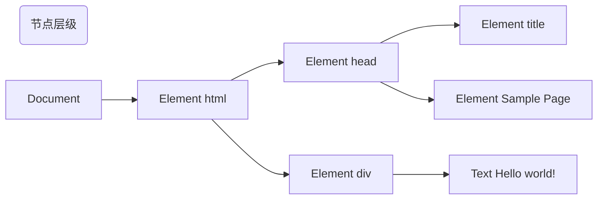
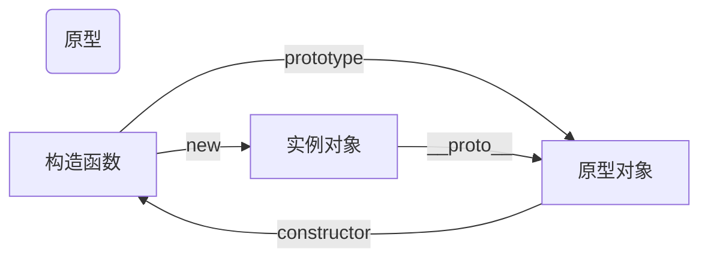

# `JS`知识点

## 1.数据类型和类型转换

	- 数值（number）：整数和小数
	- 字符串（string）：文本
	- 布尔值（boolean）：表示真伪的两个特殊值，true和false
	- undefined：表示“未定义”或不存在，没有任何值
	- null：表示空值，值为空
	- 对象（object）：各种值组成的集合
	- Symbol：ES6新增，表示独一无二的值，最大的用法是用来定义对象的唯一属性名。

   原型数据类型和引用数据类型两大类。

### 1.1`js` 基本数据类型和复杂数据类型的区别为：

1. 内存的分配不同
   - 基本数据类型存储在栈中
   - 复杂数据类型存储在堆中，栈中存储的变量，是指向堆中的引用地址。
2. 访问机制不同

   - 基本数据类型是按值访问
   - 复杂数据类型是按引用访问，`JS`不允许直接访问保存在堆内存中的对象，在访问一个对象时，首先得到的是这个对象在堆内存中的地址，然后按照这个地址去获得对象中的值
3. 复制变量时不同
   - 基本数据类型：a=b;是将b中保存的原始值的副本赋值给新变量a，a和b完全独立，互不影响
   - 复杂数据类型：a=b;将b保存在对象内存的引用地址赋值给了新变量a，a和b指向了同一个堆内存地址，其中一个值发生了改变，另一个也会改变。

### 1.2**类型转换##**

- 转Boolean：在条件判断时，除了`undefined，null，false，NaN，'',0,-0,`其他所有值都转为true。 `!!`符号可以将内容转换为布尔值。

- 对象转基本类型时，首先会调用`valueof`然后调用`toString`。并且这两个方法是可以重写的。

  ``````javascript
  let a = {
      valueOf() {
          return 0;
      }
  }
  ``````

  当然也可以重写`Symbol.toPrimitive`，该方法在转基本类型时调用优先级最高。

  ```javascript
  let a = {
  	valueOf() {
  		return 0;
  	},
      toString() {
          return '1';
      },
      [Symbol.toPrimitive]() {
          return 2;
      }
  }
  1 + a // => 3
  '1' + a // => '12'
  ```

- 转换为数值（number）类型：

  使用`Number()方法转换`，在`ES5`规范中定义了抽象操作`ToNumber`

  1. Undefined类型的值转换为`NaN`
  2. Null类型的值转换为
  3. Boolean类型的值，true转换为1，false转换为0
  4. String类型的值转换如同使用Number()函数进行转换，如果包含非数字值则转换为`NaN`，空字符串为0
  5. Symbol类型的值不能转换为数字，会报错
  6. 对象（包括数组）会首先被转换为相应的基本数据类型值，如果返回的是非数字的基本类型值，则再遵循以上规则将其强制转换为数字。为了将值转换为相应的基本类型值，抽象操作`ToPrimitive`会首先（通过内部操作`DefaultValue`）检查该值是否有`valueOf()`方法。如果有并且返回基本类型值，就使用该值进行强制类型转换。如果没有就使用`toString()`的返回值（如果存在）来进行强制类型转换。如果`valueOf()`和`toString()`均不返回基本类型值，会产生`TypeError`错误。

- 其他值转为字符串：

  ​	`ToString`，负责处理非字符串到字符串的强制类型转换。

  1. Null和Undefined类型，null转化为"null",undefined转换为"undefined"
  2. Boolean类型，转换为"true"、"false"
  3. Number类型的值直接转换，不过极小和极大的数字会使用指数形式
  4. Symbol类型的值直接转换，但是只允许显示强制类型转换，使用隐式强制类型转换会产生错误
  5. 对象，对于普通对象来说，除非自定义的`toString()`方法，否则会调用`toString()(Object.prototype.toString())`来返回内部属性[[Class]]的值，如"[object Object]"。如果对象有自己的`toString()`方法，字符串转换时就会调用该方法并使用其返回值

- **`isNaN和Number.isNaN`函数的区别？**

  函数`isNaN`接受参数后，会尝试将这个参数转换为数值，任何不能被转换为数值的值都会返回true，因此非数值传入也会返回true，会影响`NaN`的判断。

  函数`Number.isNaN`会首先判断传入参数是否为数字，如果是数字再进行判断是否为`NaN`，这种方法对于`NaN`的判断更准确。

### 1.3 什么是堆和栈

堆和栈的概念是存在于数据结构中和操作系统内存中。

- 在数据结构中，**栈**中数据的存取方式是**先进后出**。而**堆**是一个优先队列，是**按优先级来进行排序**的，优先级可以按照大小来规定。完全二叉树是堆的一种实现方式。

- 在操作系统中，内存被分为栈区和堆区。栈区内存由编译器自动分配释放，存放函数的参数值，局部变量的值等。其操作方式类似于数据结构中的栈。堆区内存一般由程序员分配释放，若程序员不释放，程序结束时可能由垃圾回收机制回收。

## 2.`Typeof`

```javascript
// 基本类型
typeof 1 // 'number'
typeof NaN // 'number' 意指“不是一个数字”，NaN是一个“警戒值”，有特殊用途的常规值，用于指出数字类型中的错误情况，即“执行数学运算没有成功，这是失败后返回的结果”。它和自身不相等，是唯一一个非自反（自反，reflexive，即 x === x 不成立）。而NaN != NaN为true
typeof "1" // 'string'
typeof undefined // 'undefined'
typeof true // 'boolean'
typeof Symbol() // 'symbol'

// 对象类型，除函数外都显示object
typeof {} // 'object'，{}valueOf结果为{}，toString结果为"[object Object]"
typeof [] // 'object',[]valueOf结果为[],toString结果为""
typeof conlose.log // 'function'

typeof null // 'object'
// null类型是基本类型，但是会显示object，这是一个存在很久的bug
// 在最初的js版本中使用的是32位系统，000开头代表是对象，null表示为全零
```

## 3. 运算符及其优先级

- **算术运算符**

  `+ - * / %`  

  1. 字符串相加，首尾相连
  2. 只要+号一端是字符串，另一端不论是什么类型，都会隐式转换为字符串（隐式转换：自动默认转换，转换方法是目标类型的构造函数强制转换）
  3. 数值加上空字符串都会转换为字符串
  4. 数值类型+布尔类型，会隐式转换为数值类型相加
  5. `undefined`会隐式转换为`NaN`
  6. 数值和除了字符串的非数值类型相加都会转换为数值类型
  7. 布尔值相加也会转换为数值
  8. 除了+以外的其他运算符都会将其他类型隐式转换为数值类型再进行计算

- **一元运算符**

  `++ 累加 -- 累减 a++先计算再自增 ++a先自增再计算 `一元运算符也是赋值运算

- **关系运算符**

  `> < <= >= == === != !==` （==，!=  会自动转换为两端类型相同后进行比较），记：0、false、"" 相等。null、undefined相等。===和!==比较时不会进行类型转换。另：`NaN == NaN`返回false

  [] == [] 返回false，两个新的数组不相等，因为数组是对象类型，也就是引用类型，两个新的数组是两个不同的引用对象，所有不相同

  [] == ![]，因为[] 相当于 "" 会隐式转换为数值0，![]为false转换为0

- **逻辑运算符**

  `! 逻辑非  && 逻辑与  || 逻辑或`  

  1. || 或运算时，两边会隐式转换为布尔值进行比较，但是会返回原值。或运算从左到右进行，只要遇到真值就返回（熔断），两个值都为假时，返回最后一个
  2. && 与运算，两个都为真时返回最后一个的值，遇到假值就返回。
  3. `eg: o=o || {a:1} 可以写成：if(!o){o={a:1};}`

- **赋值运算符**

  `*= /= %= += -= <<=左移赋值 >>=有符号右移赋值 >>>=无符号右移赋值`  在赋值变量中 ，把值赋值后并返回。在连等运算中，先将整体赋值给最左边的，有做向右。运算顺序是同时的，赋值顺序不同。`eg： b=a=a+2,先将a=a+2赋值给b再赋值给a`

- **位运算符**

  `~ 位非运算符 & 位与运算符 | 位非运算符 ^位亦或运算符 << 左移运算符 `

  `>> 右移运算符`  

  1. **~位非运算，加一取反（取整）。**~返回2的补码，并且~会将数字转换为32位整数，因此我们可以使用~来进行取整操作。

     双位非，还原取整。任何数值参与位非运算转换为数值，非数值类型转换为0。

  2. **&与运算，同1则1，其它为0。**（任何数和2相与结果为0或2，任何数和3相与结果为1|2|3，任何数和7相与结果为1|2|3|4|5|6|7）

  3. **|或运算，有1则1，其它为0。** 

  4. **^亦或运算，相同为0，不同为1。**（可以用来做对称加密）

  5. **<< 左移位运算符**，（`eg：8<<2`，8的二进制后边补两个0）

  6. **>> 右移位运算符**，（`eg：8>>2`，8的二进制后边删除两个0）

- **条件运算符**

  `三目运算符 a=b>2?2:3`

运算符优先级排序：

1.  `. [] {}`  字段访问、数组下标、函数调用以及表达式分组
2. `++ -- - ~ ！delete new typeof void` 一元运算符、返回数据类型、对象创建、未定义值
3. `* / %` 乘法、除法、取模
4. `+ - +` 加法、减法、字符串连接
5. `<<  >>  >>>` 移位
6. `<  <=  >  >= instanceof` 小于、小于等于、大于、大于等于、`instanceof`
7. `==  !=  ===  !==` 等于、不等于、严格等于、非严格等于
8. &  按位与
9. ^  按位异或
10. |  按位或
11. && 逻辑与
12. || 逻辑或
13. ？：条件  三目
14. = `oP` = 赋值、运算赋值
15. ,  多重求值


## 4.对象

对象是包括属性与方法的数据类型，`JS`中大部分类型都是对象如`String Boolean Symbol Number BigInt Object Array RegExp Date Function`等。
对象由键值对组成，键必须是字符串或Symbol类型，如果不是就会隐式转换为字符串。

### 4.1 对象的创建及其使用

创建对象：

1. 构造函数创建法

   `var 0bj = new Object();`

2. 字面量创建法：

   `var obj = {a:1};`

对象的存储：

1. 存储数据（对象的属性）
2. 存储对象（对象的方法）

### 4.2 对象的属性操作

访问对象属性：

1. 通过变量访问要使用：`obj[变量]`
2. 通过键名获取：`obj.key`或`obj["key"]`

对象属性的检测：

对象的属性分为：公有属性（原型或原型链上的）和私有属性（构造方法中的）。
`hasOwnProperty()`方法检测对象自身是否包含指定的属性，不检测原型链上继承的属性。

对象属性的可枚举性：

对象的每个属性都有一个描述对象(`Descriptor`)，用来控制该属性的行为。通过`Object.getOwnPropertyDescriptor()`方法获取属性的描述对象。描述对象的`enumerable`属性，成为“可枚举性”，如果该属性为`false`，就表示某些操作会忽略当前属性。
1. `for ... in`循环：只遍历对象自身的和继承的可枚举的属性。
2. `Object.key()`：返回对象自身的所有可枚举的属性的键名。
3. `JSON.stringfy()`：只串行化对象自身的可枚举的属性。
4. `Object.assign()`：忽略`enumerble`为`false`的属性，只拷贝对象自身的可枚举的属性。/ES6新增
尽量不要使用`for ... in`循环遍历对象，使用`Object.keys()`代替。

对象属性的遍历：

1. `for ... in` 循环遍历对象自身的和继承的可枚举属性（不包含`Symbol`属性）
2. `Object.keys(obj)` 返回一个数组，包含对象自身的（不含继承的）所有可枚举属性（不包含`Symbol`属性）的键名
3. `Object.getOwnPropertyNames(obj)` 返回一个数组，包含对象自身的所有属性（不包含`Symbol`属性，但是包括不可枚举属性）的键名
4. `Object.getOwnPropertySymbols(obj)` 返回一个数组，包含对象自身的所有`Symbol`属性的键名
5. `Reflect.ownkeys(obj)` 返回一个数组，包含对象自身的（不包含继承的）所有键名，不管键名是`Symbol`或字符串，也不管是否可枚举。

以上的5种方法遍历对象的键名都遵守同样的属性遍历的次序规则：
- 首先遍历所有数值键，按照数值升序排列
- 其次遍历所有字符串键，按照加入时间升序排列。
- 最后遍历所有`Symbol`键，按照加入时间升序排列。

```js
// 遍历出对象所有的键(私有属性即自身的)包括Symbol
let keys = [
...Object.getOwnPropertyNames(obj),
...Object.getOwnPropertySymbols(obj)
]
```

对象属性的其他操作：

1. 删除属性`delete obj.a`如果删除的属性不存在也不会报错，也会返回true
2. 判断对象中是否存在某个键，`"a" in obj`
3. 判断对象中是否存在某个值，只能通过遍历整个对象的属性
4. 通过某个属性查找对应的值，速度非常快，删除和添加操作速度也很快
5. 对象中存储的内容之间没有关联
6. 将一个对象赋值给另一个对象，引用的内存地址没有改变，修改一个对象的内容，另一个对象也会被修改。
7. 可以通过判断是否存在指定类型特有的方法来判断该数据类型。：`let target = 'push' in obj ? [] : {}`

### 4.3 对象的属性和方法

1. `Object.assign(target,sourse1,..)` 方法用于将所有可枚举属性的值从一个或多个源对象分配到目标对象。它将返回目标对象。（浅复制）

2. `Object.freeze(obj)` 方法用于冻结一个对象，被冻结的对象属性的值不能被修改，也不能增加和删除属性

3. `Object.isFrozen(obj)` 检查当前对象是否为冻结对象，返回布尔值

4. `Object.entries(obj)` 返回一个给定对象**自身**可枚举属性的键值对数组，排列与`for...in`循环遍历该对象返回的顺序一样。区别在于`for...in`还会枚举原型链中的可枚举属性。

5. `Object.isExtensible(obj)` 判断一个对象是否可扩展的（即是否可以添加新的属性）。返回值为布尔值。

6. `Object.prototype.constructor` 返回创建实例对象的`Object`构造函数引用。

7. `Object.setPrototypeOf(obj, prototype)` 方法设置一个指定对象的原型到另一个对象或`null`。**更改对象的原型在个浏览器和`js`引擎上是个很慢的操作**，所以对性能有所影响，如果担心性能问题，可以使用`Object.create()`方法来创建一个新的有指定原型的对象。

8. `Object.getPrototypeOf(obj)` 方法返回一个指定对象的原型，如果没有就返回`null`

9. `Object.create()` 创建一个新对象，使用现有的对象来提供创建的对象的`__proto__`。

   ```js
   Object.create(proto, [propertiesObject])
   // proto 新创建对象的原型对象
   // propertiesObject 可选。需要传入一个对象，该对象的属性类型参照Object.defineProperties()第二个参数。如果该参数被指定且不为undefined，该传入对象的自有可枚举属性（其自身定义的属性，而不是其原型链上的枚举属性）将为新创建的对象添加指定的属性值和对象的属性描述值。
   // 返回值：一个新的对象，带有指定的原型对象和属性
   // 例外：如果propertiesObject参数是null或非原始包装对象，则抛出一个typeError异常
   //  Object.create实现类式继承
   ```

10. `Object.defineProperties()` 直接在一个对象上定义新的属性或修改现有属性，并返回该对象

   ```js
   Object.defineProperties(obj, props)
   // obj 在其上定义或修改属性的对象
   // props 要定义其可枚举属性或修改的属性描述符的对象。对象中存在的属性描述符主要有两种：数据描述符和访问器描述符...
   // 返回值：传递给函数的对象
   ```

11. `Object.defineProperty()` 会直接在一个对象上定义一个新属性，或者修改一个对象的现有属性，并返回此对象。（应该直接在`Object`构造器对象上调用此方法，而不是在任意一个`Object`类型的实例上调用）**该方法允许精确地添加或修改对象的属性。通过赋值操作添加的普通属性是可枚举的，在枚举对象属性时会被枚举到，可以改变也可以删除这些属性。这个方法可以修改默认的额外配置，默认情况下，该方法添加的属性是不可修改（`immutable`）的。**详见下文

   ```js
   Object.defineProperty(obj, prop, descriptor)
   // obj 要定义属性的对象
   // prop 要定义或修改的属性的名称或`Symbol`
   // descriptor 要定义或修改属性的属性描述符。
   // 返回值： 被传递给函数的对象
   // eg:
    var obj = {
        name: "zfy"
    }
    Object.defineProperty(obj, "age", {
        value: "18",
        configurable: true,
        enumerable: true,
        writable: true
    })
   
   ```

   对象里目前存在的属性描述符有两种主要形式：**数据描述符和存取描述符。** **数据描述符**是一个具有值的属性，该值可以是可写的也可以是不可写的。**存取描述符**是由`getter`函数和`setter`函数所描述的属性。一个描述符只能是这两者其中之一，不能同时是两者。

   

      这两种描述符都是对象，他们共享以下可选键值（默认值是指在使用`Object.defineProperty()`定义属性时的默认值）：
    
      1. `configurable`: 当且仅当该属性的`configurable`键值为`true`时，该属性的描述符才能够被改变，同时该属性也能从对应的对象上被删除。  默认为`false`   
      2. `enumerable`: 当且仅当属性`enumerable`键值为`true`时，该属性才会出现在对象的枚举属性中。  默认为`false`

   其它一些数据描述符：

         1. `value`: 该属性对应的值。可以是任何有效的`JavaScript`值（数值、对象、函数等）默认为`undefined`
         2. `writable`当且仅当该属性`writable`键值为`true`时，属性的值，也就是上面的`value`，才能被赋值运算符改变。默认为`false`

   其它一些存取描述符：

   1. `get` 属性的`getter`函数，如果没有则为`undefined` 。当访问该属性时，会调用此函数。执行时不传入任何参数，但会传入`this`对象。返回值为被用作属性的值。
   2. `set` 属性的`setter`函数，如果没有`setter`则为`undefined`。接受一个参数（被赋予的新值），会传入`this`对象。

      


### 4.4 对象计算
对象直接参与计算时，系统会根据计算的场景在`string、number、default`间转换。
对象内部自定义`Symbol.toPrimitive/valueOf/toString`方法用来处理所有的转换场景。
在计算时优先查看是否存在`toPrimitive`方法，存在后不会去查看其他的方法，直接按照该方法进行转换。如果`toPrimitive`方法不存在就找`valueOf`方法，然后都不存在再找`toString`方法。
没有`Symbol`属性时，进行算术操作时`ValueOf`优先级高于`toString`，进行字符串操作时`toString`优先级高于`ValueOf`

### 4.5 关于垃圾回收
 `var Obj = {a:1}`，只有设置`Obj=null`（设置清空），才能断开Obj与对象的关联。将存储在栈中的Obj设置为空，表示不再引用对象，然后将堆中的这个对象的引用列表中的这个变量清除，此时垃圾回收就会把变量收走。如果一个变量被多个变量引用，只有将所有引用该对象的变量全部设置为null，才可以被垃圾回收。只有存储引用地址的变量才需要设置null来做垃圾标识，栈中的其他的变量不需要标识。

内存泄漏: 大量的不再使用的引用对象，没有被标识null，并且还在不断生成和丢弃。导致系统中无法收回或使用的内存过多，最终使得程序运行要用到内存大于提供的最大内存，此时程序就会无法运行。

## 5. 函数

1. 函数本身就是一个变量
2. `arguments`  是所有通过执行函数时传入的参数列表**它类似数组但不是数组，除了`length`属性和索引元素外没有任何`Array`属性**他可以通过以下方法转换为数组：
	```js
	var args = Array.prototype.slice.call(arguments)
	var args = [].slice.call(arguments)
	// ES2015 
	var args = Array.from(arguments)
	var args = [...arguments]
	```
3. `return` 是跳出当前函数，不再执行`return`后边的语句，并且可以返回一个数据
4. 如果函数没有`return`或者`return`没有返回数据，那么返回`undefined`
5. 函数被存储在堆中，在创建script标签时，将函数存储在堆中，并且栈中以函数名作为引用。
6. 函数可以在script标签的任意位置执行，或者当前script标签后面的所有标签中执行。
7. 函数重复声明，后面声明的函数会将前边的函数覆盖掉。
8. 如果函数没有完全执行时，内部的所有的变量都不会被销毁。

### 5.1 函数的创建：

1. 构造函数法

   ```javascript
   var fun = new Function("a","b","var sum=a+b; return s");
   // 构造函数的缺点：在调用时，浏览器会将整个函数对象内的所有内容转换为代码，这需要消耗大量的性能去转换
   // 优点：可以用来动态生成函数
   // 深拷贝，参考7.深浅拷贝
   JSON.parse(JSON.stringfy(fun))
   // JSON.stringfy()可以将对象准换为字符串
   // JSON.parse()将json格式字符串转换为对象类型
   // 以上方法缺点：JSON字符串会在转换时丢弃对象中的方法或者其他一些内容
   
   ```

   

2. 命名函数法，使用`function`命令

   ```javascript
   function fn() {
       console.log("这是函数");
   }   
   fn();
   ```

3. 匿名函数法

   ```javascript
   // 匿名函数的创建
   var fun = function(){}
   // 匿名函数不会在初始化时定义，会被运行时定义给变量，运行到赋值时才会将函数赋值给变量
   // 也就是函数赋值给变量之前不能直接调用
   
   // 自执行函数，匿名函数的自执行函数只会执行一次
   (function(){})();
   ~function(){}();
   +function(){}();
   ```

   **函数的参数：**

   参数又是局部变量

   1. 参数分为形参和实参如果实参数量小于性参数数量，未被赋值的形参是undefined，形参小于实参数量时，多出来的实参不能被形参获取

   2. 在`ES5`中不能设置参数的默认值，在`ES6`中的形参可以设置默认值，当实现没有传入对应的值，默认是形参初始值。必要的形参定义在函数的最前边，非必要的定义在后边，大多数形参默认值都是针对非必要。

   3. 因为`JS`是弱类型，所以不需要设置类型。缺点：如果封装的函数被别人使用时，传入不同类型的参数，会在成函数不可预期的错误。

   4. 在`ES6`中参数不定时可以如下书写：

      ```javascript
      function fn(...arg) {
          console.log(arg)
      } // 打印出数组
      // ...arg只能放在形参的最后
      
      // 在ES5中 arguments实参列表  只能在函数内部使用
      // arguments对象类似数组但不是数组，除了数组的length和索引元素之外没有任何数组属性
      function fn() {
          console.log(arguments) // 打印出参数列表
      }
      // 函数的形参数量通过fn.length获取
      // 函数的实参数量通过arguments.length获取
      // arguments.callee 当前函数
      // arguments.callee.name 当前函数名
      // arguments.callee.caller 调用当前函数的上下文，即指向调用函数的某个函数
      
      ```

### 5.2 **回调函数和递归：**

将一个函数以参数的形式传入到另一个函数中并且被调用执行，目的是不管执行谁，执行就行了。

回调函数容易引起回调地狱

异步回调

**递归：**

函数调用自身就是递归（recursion）。

````javascript
// 使用递归实现斐波那契数列
function fib(num) {
	if(num === 0) return 0;
    if(num === 1) return 1;
    return fib(num - 2) + fib(num - 1);
}
// 1 1 2 3 5 8 13 21 34 55
console.log(fib(10)); // 55

// 对象的遍历，广度遍历使用for in ，深度遍历使用递归
````

### 5.3 `apply`、`call`、`bind`

`apply()`方法调用一个函数，其具有一个指定的`this`值，以及作为一个数组（或类似数组的对象）提供的参数。

> `call`()方法作用和`apply()`方法类似，只有一个区别，就是`call()`方法接受的是若干个**参数的列表**，而`apply()`方法接受的是一个包含多个**参数的数组**。
>
> 使用语法：`func.apply(thisArg, [argsArray])`


`bind()`方法创建一个新的函数，当被调用时，将其`this`关键字设置为提供的值（`bind`的第一个参数），在调用新函数时，在任何提供之前提供一个给的参数序列。它不会被立即执行，只有在被调用时执行。

> 语法：`func.bind(thisArg[, arg1[, arg2[, ...]]])`


`call()`方法调用一个函数，其具有一个指定的`this`值和分别地提供的参数（参数的列表）。`call`的性能要高于`apply`。

> 语法：`function.call(thisArg, arg1, arg2, ...)`

通过`call`、`apply`求数组最大值：

```js
let arr = [1, 2, 4, 8];
Math.max.apply(null, arr);
Math.max.call(null, ...arr);
// Math.max(...arr) 更为简单一些
```

## 6. 全局变量和局部变量

全局变量： 在函数外定义的都是全局变量，全局变量可以在任意位置被调用，全局变量是建立在window中的，可以通过window调用

局部变量： 在函数内部定义的变量都是局部变量，就是函数内的局部变量。局部变量只能在当前所在的块语句中有效，不能在函数外或者别的函数中调用。局部变量只能在函数内定义，并且函数执行完毕之后会自动销毁该局部变量。

只要在函数内部定义了局部变量，在这个函数中就不能有其他的同名的全局变量，在局部变量之前调用这个局部变量都是undefined，局部变量在函数内部的优先级高于全局变量。

参数是局部变量。


## 7. 深浅拷贝

```javascript
let a = {num: 1}
let b = a
a.num = 2
console.log(b.age) // 2
// 如果给一个边量赋值一个对象，那么两者的值会是同一个引用，其中一方改变，另一方也会改变，可以通过浅拷贝来解决这个问题。
```

浅拷贝：

```javascript
// 通过Object.assign来解决
let a = {num: 1}
let b = Object.assign({},a)
a.num = 2
console.log(b.num) // 1

// 通过展开运算符解决（...）
let a = {num: 1}
let b = {...a}
a.num = 2
console.log(b.num) // 1
// 浅拷贝无法解决以下情况
let a = {num: 1, sum: {first: 'aa'}}
let b = {...a}
a.sum.first = 'bb'
console.log(b.sum.first) // bb
// 浅拷贝只能解决第一层的问题，如果第一层的值是一个对象，甚至有更多层的对象，则还会出现相同的引用，这时就需要使用深拷贝
```

深拷贝：

```javascript
let a = {num: 1, sum: {first: 'aa'}}
let b = JSON.parse(JSON.stringfy(a))
// JSON.stringfy()可以将对象准换为字符串
// JSON.parse()将json格式字符串转换为对象类型
a.sum.first = 'bb'
console.log(b.sum.first) // aa
// 这种方法是可以解决大部分问题的，并且是内置函数中处理深拷贝性能最快的
/*
 局限性:
 1. 会忽略undefined
 2. 会忽略Symbol
 3. 不能序列化函数（会忽略函数）
 4. 不能解决循环引用的对象
*/
// 如果有以上情况可以考虑使用lodash的深拷贝函数
// 未学习--------------

// 广度遍历加深度遍历（递归）实现深复制：
function fn(source, target) {
    if(target === undefined) target = {};
    for(var prop in source) {
        if(typeof source[prop] === "object" && source[prop] !== null) {
            target[prop] = {};
            fn(source[prop], target[prop]);
        }
        else {
            target[prop] = source[prop];
        }
    }
    return target;
}
var obj = {a:1,b: {c: 2, d: 3, e: {f: 4},g: 5}};
var target= fn(obj); 
console.log(target);
// ==> {a:1,b: {c: 2, d: 3, e: {f: 4},g: 5}}
obj.b.e.f = 10;
console.log(obj); 
// ==> {a:1,b: {c: 2, d: 3, e: {f: 10},g: 5}}
console.log(target);  
// ==> {a:1,b: {c: 2, d: 3, e: {f: 4},g: 5}}
```


## 8. return

return可以限定函数传入参数的类型或其他值的范围来判断是否继续执行该函数来跳出函数。

在函数的循环中使用break跳出循环继续执行函数后边的语句，在循环中使用return会直接跳出函数。

return 语句会终止函数的执行并返回函数的值。return 是`javascript`里函数返回值的关键字，一个函数内处理的结果可以使用return 返                                                                                                                                                                                                                                                                                                                                                                         回，这样在调用函数的地方就可以用变量接收返回结果。return 关键字内任何类型的变量数据或表达式都可以进行返回，甚至什么都不返回也可以

return可以返回一个数据、工厂模式、单例模式、通过参数传入的对象、如果参数是一个函数（返回的是回调函数的结果）、返回一个私密的对象、返回一个数组。返回对象、返回函数体、跳出。


## 9. `Array`方法及其重构

**创建数组：**

1. 直接创建：`var arr = [ 1,2,3 ]`

2. 创建数组对象：`var arr = new Array(size)`

    `var arr = new Array(1,2,3)`

3. 根据对象创建数组： `var arr = new Object([])`

**清空数组：**`arr.length = 0`

**使用in运算符可以判断数组元素是否为空**

```javascript
var arr = [1,2,3,,4];
3 in arr // false 
0 in arr // true 
// 数字3和0 表示数组的键名，会自动转换为字符串
// for in , forEach(),  for循环的不同
// for循环根据下标遍历每一个元素，包含空元素，不会遍历属性和方法
// forEach 不会遍历数组中的空元素，也不会遍历数组中的属性和方法
// for in 将数组小标转换为字符串遍历，并且遍历所有非空元素、属性和方法
```


### 9.1**数组方法的用法及其重构**

1. `push()` 尾部添加一个或多个元素 返回新的数组长度

   ```javascript
   // 重构push
   function array_push(arr) {
       if(arr.constructor !== Array || arr==undefined)
           throw new Error("出错");
       if(arguments.length === 1) 
           return arr.length;
       for(var i=1;i<arguments.length;i++){
           arr[arr.length] = arguments[i];
       }
       return arr.length;
   }
   var arr = [1,2,3];
   console.log(array_push(arr,4,5)); // ==>5
   console.log(arr); // ==> [1,2,3,4,5]
   ```

2. `pop()` 删除并返回数组的最后一个元素 （删除数组最后一个元素也可以使用`arr.length--`）

   ```javascript
   // 重构pop
   function array_pop(arr) {
       if(arr.constructor !== Array || arr==undefine)
           throw new Error("报错");
       if(arr.length === 0)
           return arr;
       var last = arr[arr.length-1];
       arr.length--;
       return last;
   }
   var arr = [1,2,3,4,5];
   console.log(array_pop(arr)); // ==> 5
   console.loog(arr); // ==> [1,2,3,4]
   ```

3. `shift()` 删除并返回数组的第一个元素

   ```javascript
   // shift重构
   function array_shift(arr) {
       if(arr.constryctor !== Array || arr == undefined)
           throw new Error("报错");
       if(arr.length === 0) return arr;
       var first = arr[0];
       for(var i=0;i<arr.length-1; i++) {
           arr[i] = arr[i+1]; 
       }
           arr.length--;
           return first;
   }
   var arr=[1,2,3,4];
   console.log(array_shift(arr)); // 1
   console.log(arr);  // ==> [2,3,4]
   ```

4. `unshift()` 向数组的开头添加一个或多个元素，并返回新的长度

   ```javascript
   function array_unshift() {
       if(arr.constructor !== Array || arr == undefined)
           throw new Error("报错参数");
       if(arguments.length===1) return arr.length;
           var len = arr.length = arr.length + arguments.length-1;
        while(len) {
           if(len>=arguments.length) {
                arr[len-1] = arr[len-arguments.length];
           } else {
               arr[len-1] =arguments[len];
           }
            len--;
        }
       return arr.length;
   }
   var arr = [1,2,3,4,5];
   console.log(array_unshift(arr,-1,0)); // ==> 7
   console.log(arr); // ==> [-1,0,1,2,3,4,5]
   ```

5. `concat()` 连接两个或更多的数组，并返回新的数组，可以用一个数组合并多个数组产生一个新数组，如果不写参数，则复制原数组并返回新数组

   ```javascript
   //  重构concat 
   function array_concat(arr) {
       if(arr.constructor !== Array || arr == undefined)
           throw new Error("不是一个数组");
       var arr1 = []; // 连接后返回的新数组
       for(var k=0;k<arr.length;k++) {
           arr1[k] = arr[k];
       }
       for(var i=1;i<arguments.length;i++) {
           if(arguments[i].constructor === Array) {
               for(var j=0;j<arguments[i].length;j++){
                   arr1[arr1.length] = arguments[i][j];
               }
           } else {
               arr1[arr1.length] = arguments[i];
           }
       }
       return arr1;
   } 
   var arr=[1,2,3,4];
   console.log(array_concat(arr, 5,[6,7],8)) ;
   // ==> [1,2,3,4,5,6,7,8] // 新的数组
   console.log(arr); // ==> [1,2,3,4] // 原来的数组
   
   ```

6. `join()` 把数组的所有元素放入一个字符串，元素通过指定的分隔符分割

   ```javascript
   // join 重构
   function array_join(arr,separator) {
       if(arr.constructor !== Array || arr == undefined)
           throw new Error("参数报错");
       if(arr.length === 0) return arr;
       var str = "";
       if(separator === undefined) separator = ",";
       separator = toString(separator);
       for(var i=0;i<arr.length-1;i++) {
           // 如果是数组  深度遍历
           if(arr[i].constructor === Array && arr[i] !== null)
           {
               for(var j=0;j<arr[i].length;j++) {
                   str= str + arr[i][j] + separator;
               }
           } else {
               str= str + arr[i] + separator;
           }
       }
       str=str+arr[arr.length-1];
       return str;
   }   
   var arr = [1,2,{a:1,b:2},3,4,[5,6],7]
   console.log(array_join(arr,"-")) 
   // ==> 1-2-[object Object]-3-4-5-6-7
   ```

7. `reverse()` 颠倒数组中的元素

   ```javascript
   // reverse 将数组倒置 反转数组  返回原数组,原数组被改变
   // reverse 重构
   function array_reserve(arr) {
       for(var i=0;i<Math.floor(arr.length/2);i++) {
           var temp = arr[arr.length-1-i];
           arr[arr.length-1-i] = arr[i];
           arr[i] = temp;
       }
       return arr;
   }
   var arr = [1,2,3,4,5,6,7];
   console.log(array_reserve(arr)); 
   // ==> [7,6,5,4,3,2,1]
   ```

8. `slice()` 截取。从某个已有的数组返回选定的数组，返回新的数组，原数组不会改变。

   ```javascript
   // 如果没有参数或者为0 就复制整个数组
   // 一个参数时，表示从开始位置到数组尾部
   // 负数表示倒数开始到数组尾部
   // 第二个参数表示结束位置的后一个元素下标
   // slice重构
   function array_splice(arr, start, end) {
       var arr1 = [];
       if(arr.constructor !== Array || arr === undefined) throw new Errar("不是一个数组");
       start = parseInt(start);
       if(start === undefined || isNaN(start) || (start+arr.length < 0)) start = 0;
       if(start < 0) start += arr.length;
       if(end === undefined || end > arr.length) end = arr.length;
       if(isNaN(end)) return arr1;
       end = parseInt(end);
       if(end<0) end = arr.length+end < 0 ? 0 : end+arr.length
       for(var i=start;i<end; i++) {
           arr1[arr1.length] = arr[i]; 
       }
       return arr1;
   }
   var arr = [1,2,3,4,5,6];
   console.log(array_splice(arr,2,4)); // ==> [3,4]
   console.log(array_splice(arr,2,NaN)); // ==> []
   console.log(arr); // ==> [1,2,3,4,5,6]
   // console.log(arr.slice(2, NaN)) // ==> []
   ```

9. `splice()` 删除元素，并向数组中添加新的元素，该方法返回删除元素构成的新数组。第一个参数设置起始位置，第二个参数设置删除元素的个数，第三个参数设置要添加的元素（可以是多个）。

   ```javascript
   // arr.splice() 返回一个空数组
   // arr.splice(0) 删除数组中所有元素，放在新数组中
   // arr.splice(1) 从第一项开始，不指定删除个数，默认删除至尾
   // 第一个参数可以是负数，表示从倒数的位置向尾部开始删除
   // 重构
   function array_splice(arr, start, deleteNum) {
       // 进行判断参数是否满足 处理参数
       arr1=[];
       if(arr === undefined || arr.constructor !== Array) throw new Error("参数报错");
       if(start === undefined) return arr1;
       start = Number(start);
       if(isNaN(start)) start = 0;
       if(start<0) start = start + arr.length < 0 ? 0 : start + arr.length;
       if(start > arr.length) start = arr.length;
       if(deleteNum === undefined) deleteNum = arr.length-start;
       deleteNum = Number(deleteNum);
       if(isNaN(deleteNum)) deleteNum = 0;
       if(deleteNum < 0) return arr1;
       if(deleteNum + start > arr.length) deleteNum = arr.length - start;
       // 先进行删除操作
       for(var i=start;i<arr.length;i++) {
           if(i < deleteNum + start) 
               arr1[arr1.length] = arr[i];
           arr[i] = arr[i+deleteNum];
       }
       arr.length -= deleteNum;
       // 进行添加操作
       var len = arguments.length - 3; //要添加的元素的个数
       var l = arr.length + len; // 添加后新数组的长
       while(l>start) {
           if(l>start+len) { 
               // 先往后挪元素 给要添加元素的位置腾出来
               arr[l-1] = arr[l-len-1];
           } else { // 进行添加元素
               arr[l-1] = arguments[l-start+2]; // 倒着取arguments中的元素，要使用l表示
               //  arguments[3+(l-1-start)]
           }
           l--;
       }
       return arr1;
   }
   var arr = [1,2,3,4,5,6];
   console.log(array_splice(arr, 2, 3, 1,2,3)) 
   // ==> [3,4,5]
   console.log(arr)  // ==> [1,2,1,2,3,6]
   ```

10. `sort()` 对数组的元素进行排序

    ```javascript
    // sort只有一个参数可以省略，但是若使用必须是一个函数
    // 使用sort使数组随机乱序
    var arr = [1,2,3,4,5,6,7,8,9,10,11,12,13,14];
    arr.sort(function() {
        return Math.random() - 0.5;
    })
    console.log(arr); // ==> 数组内元素被打乱 每次执行顺序随机
    // 重构sort 使用冒泡排序实现sort指定从大到小，从小到大的排序
    function array_sort(arr, fn) {
    if (arr.constructor !== Array || arr === undefined) throw new Error("不是一个数组");
    for(var i=0;i<arr.length;i++) {
        for(var j=0;j<arr.length-1-i;j++) {
            if(fn(arr[j], arr[j+1]) > 0) {
                var temp = arr[j];
                arr[j] = arr[j+1];
                arr[j+1] = temp;
            }
        }
    }
        return arr;
    }
    var arr = [1, 2, 6, 3, 7, 67, 9, 4, 74];
    console.log(array_sort(arr, function (a, b) {
        return a - b;
    })); // ==> [1, 2, 3, 4, 6, 7, 9, 67, 74]
    console.log(arr.sort(function(a, b) {
        return a - b;
    })); // ==> [1, 2, 3, 4, 6, 7, 9, 67, 74]
    ```

11. `some()` 对数组的每个元素判断是否满足条件，如果都不满足就返回false，如果有一个满足的就返回true，并且不再判断后面的内容

    ```javascript
    // some用法
    var arr = [1,2,3,4,5];
    var bool = arr.some(function(item){
        return item > 2;
        // 只要有满足条件的就返回true，否则 false
    })
    console.log(bool); // ==> true
    // some重构
    function array_some(arr, fn) {
        for(var i=0;i<arr.length;i++) {
            if(fn(arr[i]) && i in arr) return true;
        }
        return false;
    }
    var arr = [1,2,3,4,5];
    var bool = array_some(arr, function(item){
        return item > 2;
    })
    console.log(bool); // ==> true
    ```

12. `every()` 对数组的每个元素判断是否满足条件，如果有一个不满足条件就返回false，全部满足就返回true

    ```javascript
    // every用法同some
    // every重构
    function array_every(arr, fn) {
        for(var i=0;i<arr.length;i++) {
            if(!fn(arr[i]) && i in arr) return false; 
        }
        return true;
    }
    var arr = [1,2,3,4,5];
    var bool = array_every(arr, function(item) {
        return item < 4;
    })
    console.log(bool); // ==> false
    ```

13. `reduce()` 归并。方法对累计器和数组中的每个元素（从左到右）应用一个函数，将其简化为单个值（`reduceRight`()方法是从右向左，其他用法一致）

    ```javascript
    // 方法接受两个参数，第一个参数是回调函数，第二个参数是遍历初始值 
    // 函数接受四个参数1.初始值 2.当前值 3.索引值 4.当前数组
    // 函数会有一个返回值  作为下一次遍历的初始值
    // 用法
    var arr = [1,2,3,4,5];
    var arr1 = arr.reduce(function(value, item, index, arr){
        console.log(value, item, index, arr, value+item);
        return value+item;
    }, 2)
    console.log(arr1);
    // ==>
    // 10 1 0 (5) [1, 2, 3, 4, 5] 11
    // 11 2 1 (5) [1, 2, 3, 4, 5] 13
    // 13 3 2 (5) [1, 2, 3, 4, 5] 16
    // 16 4 3 (5) [1, 2, 3, 4, 5] 20
    // 20 5 4 (5) [1, 2, 3, 4, 5] 25
    // 25
    // reduce的第二个参数是第一次遍历时的初始值，如果有就从第0项开始遍历
    // 如果没有从第一项开始遍历，且第0项就是初始值
    // reduce重构
    function array_reduce(arr, fn, initValue) {
        if(arr.length === 0) return;
        if(arr.length === 1) return arr[0];
        var index = 1; 
        // 根据是否有第二个参数来判断从第几项开始遍历
        if(initValue !== undefined) {
            index = 0;
            value = initValue;
        }
        for(var i=index; i<arr.length;i++) {
            value = fn(value, arr[i], i, arr)
        }
        return value
    }
    var arr = [1,2,3,4,5];
    var value = array_reduce(arr, function(value, item, index, arr){
        // console.log(value, item, index, arr, value+item);
        return value+item;
    }, 100)
    console.log(value); // ==> 115
    ```

14. `filter()` 筛选过滤。方法创建一个新数组，其包含通过所提供函数实现的测试的所有元素，即将符合条件的元素放在一个新数组中返回，不改变原数组。接收一个函数作为参数，也可以接收第二个参数用来绑定参数函数内部的this变量。

    ```javascript
    // filter重构
    function array_filter(arr, fn) {
        var arr2 = [];
        for(var i=0;i<arr.length;i++) {
            if(fn(arr[i])) arr2[arr2.length] = arr[i];
        }
        return arr2;
    }
    var arr = [1,2,3,4,5,6];
    var arr1 = array_filter(arr, function(item) {
        return item > 2;
    })
    console.log(arr1); // ==> [3, 4, 5, 6]
    ```

15. `foreach()`  遍历数组，不会改变原数组，没有返回值，只进行遍历。

    ```javascript
    // foreach 重构 桥接模式
    function array_forEach(arr, fn) {
        for(var i=0;i<arr.length;i++) {
            if(i in arr) fn(arr[i], i, arr)
        }
    }
    var arr = [1,2,3,4,5];   
    // item 指当前元素
    // index 指当前元素下标
    // arr 指当前数组
    array_forEach(arr,function(item,index,arr){
        console.log(item,index,arr);
    })
    // ==> 1 0 (5) [1, 2, 3, 4, 5]
    // ==> 2 1 (5) [1, 2, 3, 4, 5]
    // ==> 3 2 (5) [1, 2, 3, 4, 5]
    // ==> 4 3 (5) [1, 2, 3, 4, 5]
    // ==> 5 4 (5) [1, 2, 3, 4, 5]
    ```

16. `map()` 遍历数组并且在遍历过程中处理数组，返回新的数组，原数组不会改变。因为是回调的方式，所以`foreach`和`map`遍历过程不能中断。map的回调函数可以使用return将需要的每个元素数据返回给新数组中对应的值。

    ```javascript
    // 使用map实现数组各项平方
    var arr = [1,2,3,4,5];
    var arr1 = arr.map(function(item){
        return item*item;
    })
    console.log(arr1); // ==>[1, 4, 9, 16, 25]
    // map重构
    function array_map(arr, fn) {
        var arr1 = [];
        for(var i=0;i<arr.length;i++) {
            if(i in arr) arr1[i] = fn(arr[i], i, arr);  
        }
        return arr1;
    }
    var arr = [1,2,3,4,5];
    var arr2 = array_map(arr, function(item, index, arr){
        return item*item;
    })
    console.log(arr2); // ==> [1, 4, 9, 16, 25]
    ```

17. `fill()` 填充， 第一个参数是填充的内容 、第二个参数是起始填充的下标 、第三个参数是终止填充的后一个下标

    ```javascript
    // fill 重构
    function array_fill(arr, item, start, end) {
       if(arr.constructor !== Array || arr === undefined)
           throw new Erray("不是一个数组");
        if(start === undefined) start = 0;
        if(end === undefined) end = arr.length;
        for(var i=start; i<end; i++) {
            arr[i] = item;
        }
        return arr;
    }
    var arr = [1,2,3,4];
    console.log(array_fill(arr, "#", 1, 3)); 
    // ==> [1, "#", "#", 4]
    console.log(arr); // ==> [1, "#", "#", 4]
    ```

18. `Array.from()` 将列表转化为数组，列表：必须有下标，必须有length

    ```javascript
    // Array.from重构
    Array.from_1 = function (list) {
        var arr = [];
        if (!list.length) return arr;
        for (var i = 0; i < list.length; i++) {
            arr[i] = list[i];
        }
        return arr;
        // 其他的一些方法
        // return Array.prototype.slice.apply(list);
        // return Array.prototype.slice.call(list);
        // return [].slice.apply(list);
        // return [].slice.call(list);
        // return [].concat.apply([], list);
        // return Array.prototype.concat.apply([], list);
    }
    function fn1() {
        // arguments类型是一个列表
        var arr = Array.from_1(arguments);
        console.log(arr);
    }
    fn1(1, 2, 3, 4); // ==> [1,2,3,4]
    var o = { 0: 0, "1": 1, "2": 2, length: 3 };
    console.log(Array.from_1(o)); // ==> [0,1,2]
    ```

19. `Array.isArray()` 判断是否为数组

    ```javascript
    //  Array.isArray重构
    Array.isArray_1 = function(list) {
        return (list && list.constructor === Array) ? true : false;
    }
    console.log(Array.isArray_1([1,2,{a:1}])) // ==> true
    console.log(Array.isArray_1({ a:1, b:2 })) //==>false
    ```

20. `indexOf()`  查找某个元素的，不存在返回-1，存在返回元素下标。

    ```javascript
    // 第一个参数是要查找的元素
    // 第二个元素指定从哪个位置开始查找
    // indexOf 重构
    function array_indexOf(arr, value, init) {
        if(init === undefined) init = 0;
        if(init < 0) init+=arr.length;
        for(var i=init;i<arr.length;i++) {
            if(i in arr && arr[i] === value) return i;
        }
        return -1;
    }
    var arr = [1,2,3,4,5,6];        console.log(array_indexOf(arr,2,0)); // ==>1
    ```

21. `lastIndexOf()` 从后向前查找某个元素，存在返回元素下标，不存在返回-1

    ```javascript
    // lastIndexOf()重构
    function array_lastIndexOf(arr, value, init) {
        if(init>arr.length) init = arr.length 
        var len = arr.length - 1 ;
        if(init<0) init=arr.length+init <0 ? 0 : arr.length+init;
        for(var i=init;i>=0;i--) {
            if(arr[i] === value) return i;
        }
        return -1;
    }
    var arr = [1,2,3,4,5];
    console.log(array_lastIndexOf(arr, 3, 4)); // ==> 2
    condole.log(array_lastIndexOf(arr, 3, -12)) // ==>-1
    ```
    
22. `flatMap()` 扁平化数组，将数组中嵌套的数组压缩成为一个新的数组

    ```javascript
    // flatMap() 只能处理一层嵌套的数组
    // 返回一个新的数组，不会改变原数组
    var arr = [1,2,3,[4,5,6],7];
    var arr1 = arr.flatMap(function(item) {
          return item;
    })
    console.log(arr1); // ==>[1, 2, 3, 4, 5, 6, 7]
    console.log(arr); // ==>[1, 2, 3, Array(3), 7]
    // reduce实现flatMap
    var arr = [1, 2, 3, 4, 5, [2, [3, 4], 5], [4, 5, 6, 7]];
    var arr1 = arr.reduce(function (value, item) {
         return value.concat(item);
    }, []);
    console.log(arr1);
    // ==> [1, 2, 3, 4, 5, 2, Array(2), 5, 4, 5, 6, 7]
    ```

### 9.2 **数组相关处理方法：**

1. 去重：

   ```javascript
   // 1.使用reduce去重
   var arr = [1,2,3,2,4,2,6,5,2,5];
   var arr1 = arr.reduce(function(value,item){
   if(!~value.indexOf(item)) value.push(item);
       return value;
   },[])
   console.log(arr1); // ==> [1, 2, 3, 4, 6, 5]
   // 2.使用filter去重
   var arr1 = arr.filter((item, index, array) => {
       return array.indexOf(item) === index
   })
   // 3.ES6去重
   var arr1 = arr => [...new Set(arr)];
   ```
   
   

**数组的排序方法：**

1. 冒泡排序:

   ```javascript
   // 冒泡排序，每一次比较如果满足条件都会进行交换
   // 没进行一趟，至少有一个元素已经排好
   // arr.length-1-i 每趟不和排序好了的比较
   var arr = [1,2,5,3,7,4,4,5,8,9];
   for(var i=0;i<arr.length;i++) {
   	for(var j=0;j<arr.length-1-i;j++) {
           if(arr[j] <  arr[j+1]) {
               var temp = arr[j];
               arr[j] = arr[j+1];
               arr[j+1] = temp;
           }
       }
       return arr;
   }
   console.log(arr);//==> [9, 8, 7, 5, 5, 4, 4, 3, 2, 1]
   ```

2. 选择排序：

   ```javascript
   // 每个元素都会和后边的进行比较，但是在比较完一轮后才进行交换
   var arr = [1,2,5,6,7,3,8,3,83,3];
   for(var i=0;i<arr.length;i++) {
       var max = i;
       for(var j=i+1;j<arr.length;j++) {
           if(arr[max] < arr[j]) max = j;
       }
       if(i !== max) {
          var temp = arr[i];
           arr[i] = arr[max];
           arr[max] = temp;
          }
       return arr;
   }
   console.log(arr);// ==>[83, 8, 7, 6, 5, 3, 3, 3, 2,1]
   ```

3. 快速排序：

   ```javascript
   // 快速排序，使用递归，不能对大型数据排序，会造成堆栈上线溢出
   // 取出数组中的一个值，让其他的与他比较，小的放左边，大的放右边
   // 
   function fn(arr) {
       if(arr.length<=1) return arr;
       var index = Math.floor(arr.length/2);
       var temp = arr.slice(arr[index])[0];
       var left = [];
       var right = [];
       for(var i=0;i<arr.length;i++) {
           if(arr[i] < temp) left.push(arr[i]);
           else right.push(arr[i]);
       }
       return fn(left).concat(temp, fn(right));
   }
   var arr = [13,3,4,5,2,323,42,9,-1];
   console.log(fn(arr)); 
   // ==>[-1, 2, 3, 4, 5, 9, 13, 42, 323
   ```

## 10. String对象及其使用

### `slice, substring，substr`三者区别：

slice和substring两者都是截取start到end（不包括）之间的字符串，都允许参数为负数。slice的start必须在end之前，否则返回空，slice可以指定切割元素进行截取，与join功能相反。`subString`会将负数转换为0，然后取两者个参数较小的到较大的之间进行截取。

### 字符串创建：

```javascript
var str = new String("abc");
var str = "abc";
// 字符串属性：length
// 字符串长度是只读属性不能修改
// 访问String[0] 也是只读 不可以修改
// constructor 对创建该对象的函数的引用
// prototype 允许您向对象添加属性和方法
```

### 字符串方法：

```javascript
// charAt()  返回在指定位置的字符
// charCodeAt() 返回在指定的位置的字符的Unicode编码
// concat() 连接字符串（返回新的字符串） 字符串连接也可以直接相加
// fromCharCode() 从字符编码创建一个字符串（将Unicode编码转为字符）
// indexOf()  返回某个指定的字符串值在字符串中首次出现的位置
// lastIndexOf() 从后向前搜索字符串出现的位置
// includes() 查找字符串中是否包含指定的子字符串
// replace() 在字符串中查找匹配的字符串，并替换与正则表达式匹配的子串
// search() 查找与正则表达式匹配的值
// slice() 提取字符串片段，并在新的字符串中返回被提取的部分
// split() 把字符串分割为字符串数组
// substr() 从起始索引号提取字符串中指定数目的字符
// substring() 提取字符串中两个指定的索引号之间的字符
// toLocaleLowerCase() 把字符串换换为小写（根据本地主机的语言环境）
// toLocaleUpperCase() 把字符串转换为大写（根据本地主机的语言环境）
// toLowerCase() 把字符串转换为小写
// toUpperCase() 把字符串转换为大写
```

 ### `slice、substr、substring`的比较：

> 都是接收两个参数，slice和substring接收的是起始位置和结束位置（不包括结束位置），而`substr`接收的是起始位置和要返回的字符串的长度。      
>
> substring不同的地方是两个参数中较小的作为开始位置，较大的作为结束位置。 并且参数为负数时都直接转换为0.          

### 用法实例：

```javascript
// 随机验证码
var str = getAuth();
console.log(str);
function getAuth() {
    var arr = [];
    // 字符编码0~9(48-57) a~z(65-90) A~Z(97-122) 
    for(var i=48;i<123;i++) {
        if(i>57 && i<65) continue;
        if(i>90 && i<97) continue;
        arr.push(String.fromCharCode(i));
    }
    arr.sort(function(){
        return Math.random()-0.5;
    })
    arr.length = 4;
    return arr.join("");
}
// 字符串截取转为对象
var url = "http://www.163.com/new/index.html?token=123&name=lihua&age=30";
function getObject(url) {
    url = url.split("?")[1];
    var obj = {};
    var arr = url.split("&");
    for(var i=0;i<arr.length;i++) {
        var arr1 = arr[i].split("=");
        obj[arr[0]] = isNaN(arr1[1]) ? arr1[1] : Number(arr[1]);
    }
    return obj;
}
// 另一种写法
function getObject(url){
return url.split("?")[1].split("&").reduce(function(value,item){
var arr=item.split("=");
value[arr[0]]=isNaN(arr[1]) ? arr[1] : Number(arr[1]);
return value;
},{});
}
```

## 11. Number对象

方法：

> `toFixed` 把数字转换为字符串，结果的小数点后由指定位数的数字
>
> `toLocaleString`  把数字转换为字符串，使用本地数字格式顺序。
>
> `toExponential` 把对象的值转换为指数计数法
>
> `toPrecision` 把数字格式化为指定的长度


## 12. Math对象

常用方法：

> abs() 返回绝对值
>
> `ceil`() 向上取整
>
> floor() 向下取整
>
> random() 返回0~1之间的随机数
>
> round() 四舍五入

##  13. `BOM`

### 13.1 `BOM`核心对象window：

   window对象在浏览器有两重身份，一个是`ECMAScript`中的Global对象，另一个就是浏览器窗口的JavaScript接口。这就意味着网页中定义的所有对象、变量和函数都以window作为其Global对象，都可以访问其上定义的全局方法。

   > ###### Global作用域：
   >
   > var声明的所有的全局变量和函数都会变成window对象的属性和方法。

   1. open("要打开网页","名字","宽高位置等样式")
   2. close() 关闭网页
   3. `innerHeight innerwidth`  浏览器窗口的内部高度、宽度(兼容所有浏览器) 包含滚动条
   4. `outerWidth outerHeight`  可以获取浏览器窗口的整个宽、高
   5. `screenLeft screenTop` 属性返回窗口相对于屏幕的x、y坐标，火狐浏览器不支持，可以使用`screenX/screenY`

### 13.2  location对象:

   获取页面信息，它既是window的属性也是location的属性。

   > reload() 重新加载当前页面
   >
   > `location.hash` URL散列值（井号后跟零或多个字符），没有则为空字符串
   >
   > `location.href` 当前加载页面的完整URL
   >
   > `location.host` 服务器名及端口号
   >
   > `location.hostname` 服务器名
   >
   > ` location.pathname` URL中的路径或文件名
   >
   > `location.port` 请求的端口号，如果没有就返回空字符串
   >
   > `location.portocol` 页面使用的协议，一般为`http:或https:`
   >
   > `location.search` URL的查询字符串
   >
   > `location.username` 域名前指定的用户名
   >
   > `location.password` 域名前指定的密码
   >
   > `location.origin` URL的源地址，只读

   除了hash之外，只要修改location的一个属性就会导致页面重新加载新的URL。修改hash的值会在浏览器历史中新增一条新纪录。如果不希望增加历史记录，可以使用replace() 方法，这个方法接受一个URL参数，但重新加载之后不会增加历史记录。调用replace()之后，用户就不能回到前一页。

### 13.3 history对象：

   操作浏览器历史，history对象表示当前窗口首次使用以来用户的导航历史记录。以为history是window的属性，所有每个window都有 自己的history对象。出于安全考虑，这个对象不会暴露用户访问过的URL，但可以通过它在不知道实际URL的情况下前进后退。

   > `history.go(-1)` 后退一页
   >
   > `history.go(1)` 前进一页
   >
   > `history.go("wrox.com")` 导航到最近的`wrox.com`页面
   >
   > `history.back()` 后退一页
   >
   > `history.forword()` 前进一页
   >
   > `history.lenght` 表示历史记录中有多个条目 

   > **历史状态管理**
   >
   > `history.pushState()` 接收三个参数，state对象、新状态标题、相对URL(可选)。 `pushState()`方法执行后，状态信息就会被推倒历史记录中，浏览器地址也会改变以反映新的相对URL。
   >
   > **页面初次加载时没有状态，`event.state`会为null**
   >
   > `history.state` 可以用来获取当前状态信息。
   >
   > `history.replaceState()` 更新状态不会创建新的历史记录，只会覆盖当前状态。

### 13.4. navigator对象

   > 只要浏览器启用`javascript`，`navigator`对象就一定存在。
   >
   > `userAgent`返回由客户机发送服务器的`user-agent`头部 的值
   >
   > `appName` 返回浏览器的名称
   >
   > `appVersion` 返回浏览器的平台和版本信息
   >
   > `platform` 返回运行浏览器的操作系统平台

### 13.5 screen对象

   > window的另一个属性screen对象，是很少用的一个对象。这个对象中保存的纯粹是客户端能力信息，也就是浏览器窗口外面的客户端显示器的信息，比如像素宽度和像素高度。
   >
   > height width 屏幕的宽高像素
   >
   > left top 当前屏幕左边、顶端的像素距离
   >
   > `availHeight availWidth` 屏幕像素高度剑气系统组件高度（宽度）


## 14. DOM

### 14.1 节点



document节点表示每个文档的根节点。

1. 节点属性：

   > `nodeName:`  节点名称，元素节点是标签名称，文本节点是#text，注释节点是#comment
   >
   > `nodeValue`：节点值，文本节点值是包含文本，元素节点不可用，注释节点是注释内容
   >
   > `nodeType:` 节点类型，元素--1，属性--2，文本--3，注释--8，文档--9 
   >
   > `div.constructot` : 判断标签类型
   >
   > 什么是元素：
   >
   > 元素就是HTML标签。不包含注释、文本、换行、文档
   >
   > 什么是节点：
   >
   > 节点是构成整个网页的最基本的组成部分，网页中的每一部分都是节点。文档节点、元素节点、属性节点、文本节点

2. 节点关系：

   > Node:
   >
   > `childNodes:` 所有子节点，包括注释
   >
   > `children:` 所有是标签类型的子节点  获取所有子元素 
   >
   > `firstChild`: 第一个子节点
   >
   > `lastChild`:  最后一个子节点
   >
   > `firstElementChild`: 第一个节点（元素）
   >
   > `lastElementChild`: 最后一个子节点（元素）
   >
   > `parentNode`: 父节点 
   >
   > `nextSibling:` 下一个兄弟节点
   >
   > `previousSibling:` 上一个兄弟节点
   >
   > `nextElementSibling:` 下一个兄弟节点（元素）
   >
   > `lastElementSibling:` 上一个兄弟节点（元素）
   >
   > `document.creteDocumentFragment()` 文档碎片容器，也叫虚拟节点对象

3. 创建节点

   > `doucument.creeateElement("标签名")` 创建新元素
   >
   > `document.createTextNode("")` 创建文本节点

4. 插入节点

   > `appendChild(node):` 向`childNodes`末尾插入一个节点node
   >
   > `insertBefore(newElement, targetElement)` 向`targetNode`之前插入节点Node

5. 替换节点

   > `replaceChild(newNode,oldNode) : newNode替换节点oldNode`

6. 删除节点

   > `removeChild(node)` 移除父节点的某个子节点
   >
   > `remove()`移除当前节点

7. 复制节点

   > `cloneNode(boolean)` 复制一个节点 `Boolean：true`深复制，false浅复制

### 14.2 Dom属性

标签属性和DOM对象属性：

标签属性是在HTML标签上使用的属性，分为默认属性和自定义属性，自定义属性命名和属性值使用小写字母及短横线连接。

DOM对象属性也分为默认属性和自定义属性，DOM对象属性和标签属性不一定相同，也不一定可以互相获取。DOM中的自定义属性和标签的自定义属性是完全不能互相调用的。

DOM对象可以修改标签属性映射的值（不会更改原有的属性值），只在第一次渲染时修改。

可以通过DOM属性调用的标签属性：

> `title id src href alt placeholder type value 等`
>
> `class`标签属性通过DOM调用是`className`

1. `dom` 常用属性：

   > `document.body:` body元素
   >
   > `document.documentElement` 获取根节点即`html`节点
   >
   > `document.title:` 获取、设置文档的标题
   >
   > `document.URL:` 获得完整的URL
   >
   > `document.domain:` 获取域名

2. 获取、创建、删除节点属性

   > `getAttribute(属性):` 获取属性值
   >
   > `setAttribute(属性，值):` 设置属性和属性值，是可以在浏览器看到的，会引起重绘
   >
   > `removeAttribute(name):` 删除属性

### 14.3 Dom对象的样式

> 设置DOM对象样式，这种方式设置的属性为行内样式，具有较高的优先级
>
> `dom.style.styleName`="",`div.style.height="30px"`
>
> 还可以这样写：
> `div.style="height:50px;width:50px;background-color:red;"`
>
> `style`是一个样式属性，只能给DOM对象设置行内样式，只能给单个DOM对象设置样式。
>
> `getComputedStyle(对象，伪类).left` 获取计算后的DOM样式属性，可以获取行内样式和`CSS`样式，`IE8`及以下不支持
>
> `IE8`及以下可以使用`currentStyle.left` 谷歌不支持

> 另一种设置style样式的方式：
>
> `Object.assign(div.style,{  width: "50px",  height: "50px"  })`


## 15.事件

JavaScript和HTML的交互是通过**事件**实现的，事件代表文档或浏览器窗口中某个有意义的时刻。可以使用仅在事件发生时执行的**监听器**（页脚程序处理）订阅事件。在传统软件工程领域，这个模型叫“**观察者模式**”，其能够做到页面行为与页面展示的分离。

**事件流**描述了页面接收事件的顺序。

### 15.1 事件基础

事件的本质是程序各个组成部分之间的一种通信方式，也是异步编程的一种实现。

DOM的事件操作（监听和触发），都定义在`EventTarget`接口。所有节点对象都部署了这个接口，其他一些需要事件通信的浏览器内置对象（比如，`XMLHttpRequest`、`AudioNode`、`AudioContext`）也部署了这个接口。

`EventTarget`接口主要提供的三个实例方法：

1. `addEventListener`: 绑定事件的监听函数

   > 用于在当前节点或对象上，定义一个特定事件的监听函数，一旦这个事件发生就会执行监听函数。该方法没有返回值。
   >
   > 此方法接收三个参数：
   >
   > `type`：事件名称，区分大小写
   >
   > `listener`：监听函数，事件发生时会调用该监听函数。该函数有且只有一个参数，这个参数就是触发的事件对象。这个函数是在事件处理后回调的函数，没有返回值，不能使用return。
   >
   > `useCapture`：布尔值，表示监听函数是否在捕获(capture)阶段触发，默认为false。第三个参数也可以是一个配置对象，包含以下属性：
   >
   > - `capture`: 布尔值，表示该事件是否在捕获阶段触发监听函数。默认为false
   > - `once` ： 布尔值，表示监听函数是否只触发一次，然后就自动移除。、
   > - `pessive`：布尔值，表示监听函数不会调用事件的`preventDefault`方法，如果监听函数调用了，浏览器将忽略这个要求，并在监控台输出一行警告。

2. `removeEventListener`：移除事件的监听函数

   > 该方法用来移除`addEventListener`方法添加的事件监听函数，没有返回值。两个方法参数完全一致。必须是对同一元素节点，同一个匿名函数，第三个参数也必须相同。

3. `dispatchEvent`：触发事件，在自定义事件中使用

   ```javascript
   // 该方法在当前节点上触发指定事件，从而触发监听函数的执行，返回一个布尔值，只要有监听函数调用了Event.preventDefault()就返回false否则为true
   // 监听事件必须在前
   para.addEventListener("click", hello, false);
   // 创建事件对象  事件对象可以携带数据
   var event = new Event("click");
   // 触发事件
   para.dispatchEvent(event);
   ```

### 15.2 事件原理

浏览器的事件模型，就是通过监听函数(listener)对事件做出反应。事件发生后，浏览器监听到了这个事件，就会执行对应的监听函数。这是**事件驱动编程模式**(event-driven)的主要编程方式。

事件是针对事件目标对象的，事件的触发会根据DOM树形结构来传递事件。

阻止默认事件：`event.preventDeault()`  兼容写法：`even.returnValue=false`

**`javascript`为事件绑定监听函数的三种方式：**

1. 通过HTML的on属性

   ```javascript
   <div onclick="dosomthing()"></div>
   // 属性值中的内容会传入javascript引擎执行，若是执行函数不能缺少括号
   // 会自动设计一个event全局变量，用于事件的处理，同步执行不会丢失，异步执行延迟 会清除
   // 也可以书写js代码
   <div onclick="console.log('test')"></div>
   ```

2. 元素节点的事件属性

   ```javascript
   // 只能执行一个函数，有冒泡功能，没有捕获功能
   // 这种写法大多都会写成匿名函数，大多数的回调地狱都是在事件函数中发生的，因为匿名函数的使用。
   // 不支持自定义事件
   div.onclick = function (event) {
       console.log('触发事件');
   } 
   // 或者
   div.onclick = dosomething;
   function dosomething(event) {
       console.log('触发事件');
   }
   ```

3. 使用`EventTarget.addEventListener()`，这种方法一般不写匿名函数，写命名函数，适合于函数式编程。包括捕获、冒泡阶段和阻止。支持自定义事件，可以执行多个函数。`IE8`及以下不支持。

   所有DOM节点实例都有`addEventListener`方法，用来为该节点定义事件的监听函数。

   `window.addEventListener('load', dosomething, false)`
   
   **`IE11`以下：**没有捕获阶段
   
   `bn.attachEvent("onclick", clickHandler)`;

**在监听函数内部的this指向触发事件的那个元素节点。**在事件触发函数中`e.target` 和 `e.srcElement`相同 都是事件触发的目标对象。 `this`和`e.currentTarget` 都是事件侦听的目标对象

**事件的传播机制**

一个事件发生后，子元素会在父元素之间传播(`propagation`)。传播分为三个阶段：

1. 第一阶段：从`window`对象传导到目标节点（上层传到底层），称为“捕获阶段”（`capture phase`）。在捕获阶段只有`useCapture`设置为true的监听器才被调用。
2. 第二阶段：在目标节点上触发，称为“目标阶段”（`target phase`）。在目标阶段调用目标事件的所有监听器。
3. 第三阶段：从目标节点传导回`window`对象（从底层传回上层），称为“冒泡阶段”（`bubbling phase`）。在冒泡阶段只有`useCapture`设置为false的监听器才被调用。

```javascript
<div>
	<p>事件传播</p>    
</div>
···
var div = document.querySelector("div")
var p = document.querySelector("p")

div.addEventListener('click', callback, true)
div.addEventListener('click', callback1, false)
p.addEventListener('click', callback2, true)
p.addEventListener('click', callback3, false)

function callback(e) { console.log(0); }
function callback1(e) { console.log(1); }
function callback2(e) { console.log(2); }
function callback3(e) { console.log(3); }
// 点击p之后，以上代码执行结果输出顺序：0 2 3 1
// 事件的传播先由外到内（从上层到下层）：div-->p
// 再有内向外（从下层到上层）: p-->div
```

事件传播的最上层对象是window，接着依次是：`document` 、`html(document.documentElement)`、`body(document.body)` 。

**阻止事件的传递：**

`event.stopPropagation()`  ,  事件对象中的方法

`event.canclebubble=true`, 同上，`IE8`及其以下支持

使用阻止事件传递以后，在阻止事件后序的事件不再执行。


### 15.3 `Event`对象

事件发生后，会产生一个事件对象，作为参数传给监听函数。浏览器原生提供一个`Event`对象，所有的事件都是这个对象的实例，或者说继承了`Event.prototype`对象。`Event本身就是一个构造函数`。

1. `change`：
2. `error`：
3. `load`
4. `reset`
5. `resize`
6. `select`
7. `submit`：
8. `scroll`：


### 15.4 事件委托

事件委托：将子元素或者后代元素的事件委托给父元素，减少对事件监听的增加，可以防止内存泄漏。

只要可行，就可以考虑只给document添加一个事件处理程序，通过它处理页面中所有某种类型的事件。

事件委托的优点：

1. document对象随时可用，任何时候都可以给它添加事件处理程序（不用等待`DOMContentLoaded`或`load`事件）。这意味着只要页面渲染出可惦记的元素，就可以无延迟地起作用。
2. 节省花在设置页面事件处理程序上的时间。只指定一个事件处理程序既可以节省DOM引用，也可以节省时间。
3. 减少整个页面所需的内存，提示整体性能。


### 15.5 鼠标事件

**鼠标相关的事件**，继承了`MouseEvent`接口。

- `click`：单击鼠标时主键触发。（通常是左键）或按下回车时触发。
- `dblclick`：双击鼠标主键时触发（通常是左键）
- `mousedown`：按下任意鼠标键时触发，不能通过键盘触发。
- `mouseenter`：鼠标光标从元素外部移动到元素内部时触发。这个事件不冒泡，也不会在光标经过后代元素时触发。`DOM3Events`中新增。
- `mouseleave`：鼠标光标从元素内部移动到元素外部时触发。这个事件不冒泡，也不会在光标经过后代元素时触发。`DOM3Events`新增。
- `mousemove`：鼠标光标在元素上移动反复触发。不能通过键盘触发。
- `mouseout`：鼠标光标从一个元素上移动到另一个元素上时触发。移动的元素可以是原始元素的外部元素，也可以是原始元素的子元素。
- `mouseover`：鼠标光标从元素外部移动到元素内部时触发。不能通过键盘触发。
- `mouseup`：用户释放鼠键时触发。不能通过键盘触发。

页面中的所有元素都支持鼠标事件。除了`mouseenter`和`mouseleave`，所有鼠标事件都会冒泡，都可以被取消，而这会影响浏览器的默认行为。

在双击事件中触发顺序：

`mousedown->mouseup->click->mousedown->mouseup->click->dblclick`

**鼠标事件`MouseEvent`接口的相关坐标：**

1. 客户端坐标：`clientX`、`clientY`。表示事件发生时鼠标在视口中的坐标。
2. 页面坐标：`pageX`、`pageY`。事件发生时鼠标在相对整个页面的坐标。在页面没有滚动时，和`clientX`、`clientY`的值相同。
3. 屏幕坐标：`screenX`、`screenY`。事件发生时鼠标在整个屏幕中的坐标。
4. `offsetX`、`offsetY`：鼠标位置与目标节点左侧的`padding`边缘的水平距离。
5. 鼠标相对移动：`movementX`、`movementY`用于`mousemove`事件，鼠标相对上次的坐标。

在事件发生时，是否按下对应的键： 返回一个布尔值，只读。

- `altKey`：`Alt`键
- `ctrlKey`：`Ctrl`键
- `mateKey`：`window`键
- `shiftKey`：`Shift`键

`MouseEvent.button`表示事件发生时按下了鼠标的哪个键，只读：

- 0：按下主键（通常是左键）。
- 1：按下辅助键（中间或滚轮）。
- 2：按下次键（通常是右键）。

`MouseEvent.buttons`表示事件发生时按下了鼠标的哪个键，只读：

- 1: 二进制位`001`，表示按下左键
- 2：二进制位`010`，表示按下右键
- 4：二进制`100`，表示按下中键或滚动键

同时按下多个键的时候，是对应的值相加。


### 15.8 图片预加载

**什么是预加载：**

资源预加载是另一个性能优化技术，我们可以使用该技术预先告知浏览器某些资源可能在将来会被使用到。**预加载简单来说就是将所有所需的资源提前请求加载到本地，这样后面在需要用到时就直接从缓存取资源。**

**为什么使用预加载：**

在网页全部加载之前，对一些主要内容进行加载，以提供给用户更好的体验，减少等待的时间。否则，如果一个页面的内容过于庞大，没有使用预加载的页面就会长时间的展现一篇空白，直到所有内容加载完毕。

**实现预加载的几种方法：**

1. 使用HTML标签

   ```javascript
   
   ```

2. 使用`Image`对象

   ```javascript
   var image = new Image();
   image.src = "http://future.jpg";
   ```

3. 使用`XMLHttpRequest`对象，虽然存在跨域问题，但会精细控制预加载过程

   方法

4. 使用`PreloadJS`库


### 15.8 `JS`拖拽功能的实现

涉及三个事件：`mousedown、mousemove、mouseup`


## 16.原型和原型链


### 16.1 构造函数、实例、原型、原型链

1. **构造函数**

   一般为了区分构造函数和普通函数的区别，将构造函数的首字母大写。

2. **实例**

   通过new关键字获取构造函数的一个实例。可以通过`instanceof`来检查某个对象是不是某个构造函数的实例。`instanceof`检测机制就是通过判断某个构造函数的`prototype`属性是否出现在实例的原型上。

3. **原型：**

**对象都有`__proto__`属性，指向对应的构造函数的`prototype`属性。**`Class`作为构造函数的语法糖，同时拥有`prototype` 属性和`__proto__`属性，因此存在两条继承链。

**每一函数数据类型（除箭头函数外），都自带一个`prototype`原型属性**，属性值是一个对象(`Function.prototype`除外)，并且原型对象自带一个属性：`constructor`，属性值是当前构造函数本身。每一个对象数据类型值都自带一个属性（`__proto__`原型链属性），属性值指向所属类的原型对象(`prototype`)

- 可以将原型理解为对象的父亲，对象从原型对象继承来属性
- `prototype`也是一个对象
- 使用原型对象为多个对象共享属性或方法，这样可以解决通过构造函数常见对象时复制多个函数造成的内存占用问题。
- 如果对象本身不存在属性或方法将到原型链上查找
- 原型包括`constructor`属性，指向构造函数
- 对象包含`__proto__`指向类的原型对象



4. 原型链：

首先查找自己私有的属性，私有属性中存在则使用私有的，不存在则默认基于`__proto__`找到所属类`prototype`上的，如果还没有，则基于`prototype`上的`__proto__`继续向上查找，直到找到`Object.prototype`为止，我们把这种查找机制叫做原型链。

### 16.2 `instanceof` 

**`instanceof`运算符用于检测构造函数的prototype属性是否出现在某个实例对象的原型上**   `object instanceof constructor`

### 16.3 设置和获取原型

### 16.4 原型的重定向

原型的重定向会引发`constructor`丢失

## 17.闭包

### 17.1 作用域
`JavaScript`有两种作用域：全局作用域和函数作用域。函数内部可以直接读取全局变量，正常情况下函数外部无法读取函数内部声明的变量。
全局作用域只有一个，每个函数都有作用域。`es6`新增了块级作用域。作用域链式向上查找，找到全局`window`即终止，应该尽量不要在全局作用域中添加变量。
**函数被执行后其环境变量将从内存中删除，函数每次调用都会创建一个新的作用域。** 如果子函数被使用时父级环境变量将保留 -- 闭包。

### 17.2 闭包的定义和用途

闭包是指有权访问另一个函数作用域中变量的函数，创建闭包的最常见方式就是在一个函数内创建另一个函数，创建的函数可以访问到当前函数的局部变量。

（函数A返回了一个函数B，并且函数B中使用了函数A的变量，函数B就被称为闭包。）

**用途：**

1. **在函数外部可以访问到函数内部的变量。**通过使用闭包，我们可以通过在外部调用闭包函数，从而在外部访问到函数内部的变量，可以使用这种方式来创建私有变量。
2. **使已经运行结束的函数上下文中的变量对象继续留在内存中。**因为闭包函数保留了这个变量对象的引用，所以这个变量对象不会被收回。
3. 避免全局变量的污染。

**使用闭包的弊端**
使用闭包内存不能释放，导致内存太大，页面渲染变慢，性能受到影响。

**经典面试题：**

循环中使用闭包解决var定义问题：

```javascript
for(var i=1;i<=5;i++) {
 setTimeout(function timer(){
     console.log(i);
 },i*1000);
}
//因为setTimeout是个异步函数，所以会先把循环全部执行完毕，这时候i就是6了，所以会输出一堆6
```

解决办法：

1. 使用闭包

   ```javascript
   for (var i = 1; i <= 5; i++) {
     (function(j) {
       setTimeout(function timer() {
         console.log(j);
       }, j * 1000);
     })(i);
   }
   // 将i传入匿名函数，返回内部的定时器的回调函数使用了匿名函数的变量j
   ```

2. 使用`setTimeout`第三个参数

   ```javascript
   for ( var i=1; i<=5; i++) {
   	setTimeout( function timer(j) {
   		console.log( j );
   	}, i*1000, i);
   }
   ```

3. 使用let定义i

   ```javascript
   for ( let i=1; i<=5; i++) {
   	setTimeout( function timer() {
   		console.log( i );
   	}, i*1000 );
   }
   // 对于let来说他会创建一个块级作用域，相当于：
   { // 形成块级作用域
     let i = 0
     {
       let ii = i
       setTimeout( function timer() {
           console.log( ii );
       }, i*1000 );
     }
     i++
     {
       let ii = i
     }
     i++
     {
       let ii = i
     }
     ...
   }
   ```


## 18.`this`的使用

this是执行上下文中的一个属性，它指向最后一次调用这个方法的对象。在实际开发中，this的指向可以通过四种调用模式来判断。

1. 第一种是函数调用模式，当一个函数不是一个对象的属性时，直接作为函数来调用时，this指向全局对象。
2. 第二种是方法调用模式，如果一个函数作为一个对象的方法来调用时，this指向这个对象。
3. 第三种是构造器调用模式，如果一个函数用new调用时，函数执行前会新创建一个对象，this指向这个新创建的对象。
4. 第四种是apply、call和bind调用模式，这三个方法都可以显式的指定调用函数的this指向。apply和call允许切换函数执行的上下文环境(context)。

**在函数中，在严格模式下，this是未定义的undefined。**

**在事件中this表示接收事件的元素**

**箭头函数中的this只取决于它外面的第一个不是箭头函数的函数的this。即this指向箭头函数外上下文环境的this指向**

**所有回调函数中this都会被重新指向为window**

**`IE6-8`中基于`attachEvent`实现事件绑定，事件触发方法执行，方法中的`this`不是元素本身，一般情况下指向`window`**


## 19. 浏览器渲染机制

**浏览器渲染步骤：**

1. 处理`HTML`并构建`DOM`树
2. 处理`CSS`构建`CSSOM`树
3. 将DOM与`CSSOM`合并成一个渲染树
4. 根据渲染树来布局，计算每个节点的位置
5. 调用`GPU`绘制，合成图像，显示在屏幕

在构建`CSSOM`树时，会阻塞渲染，直至`CSSOM`树构建完成。并且构建`CSSOM`树是一个十分消耗性能的过程，所以应该尽量保证层级扁平，减少过渡层叠，越是具体的`css`选择器，执行速度越慢。

当`HTML`解析到`script`标签时，会暂停构建`DOM`，完成后才会从暂停的地方重新开始。也就是说，如果你想要首屏渲染的越快，就不应该在首屏就加载JS文件。并且`CSS`也会影响`JS`的执行，只有当解析完样式表才会执行JS，所以也可以认为这种情况下，`CSS`也会暂停构建`DOM`。

**`Load`和`DOMContentLoaded`区别###**

Load事件触发代表页面中的DOM，`CSS`，`JS`，图片已经全部加载完毕。

`DOMContentLoaded`事件触发代表初始的HTML被完全加载和解析，不需要等待`CSS`，`JS`，图片加载。

**图层###**

一般来说，可以把普通文档流看成一个图层，特定的属性可以生成一个新的图层。不同的图层渲染互不影响，所以对于某些频繁需要渲染的建议单独生成一个新图层，提高性能。但也不能生成过多的图层，会引起反作用。

通过以下几个常用属性可以生成新图层

- `3D`变换：`translate3d`、`translateZ`
- `will-change`
- `vidio`、`iframe`标签
- 通过动画实现的opacity动画转换
- `position：fixed`

**重绘（`Repaint`）和回流（`Reflow`）**

重绘和回流是渲染步骤中的一小节，但是这两个步骤对于性能影响很大。

- 重绘是当节点需要更改外观样式而不会影响布局的，比如改变color就称为重绘
- 回流是布局或者几何属性需要改变就称为回流。

回流必定会发生重绘，重绘不一定发生回流。回流所需要的成本比重绘高的多，改变深层次的节点很可能导致父节点的一系列回流。

所以以下几个动作可能会导致性能问题：

- 改变window大小
- 改变字体
- 添加或删除样式
- 文字改变
- 定位或浮动
- 盒模型

重绘和回流其实和Event loop有关。

未完。。。https://yuchengkai.cn/docs/frontend/browser.html#%E9%87%8D%E7%BB%98%EF%BC%88repaint%EF%BC%89%E5%92%8C%E5%9B%9E%E6%B5%81%EF%BC%88reflow%EF%BC%89


## 20.`ES6`相关知识

### 20.1 严格模式

在`es6`中使用严格模式（"use strict"）：

- 变量名必须声明后使用
- 函数的参数不能有同名属性，否则报错
- 不能使用with语句
- 不能对只读属性赋值，否则报错
- 不能使用前缀0表示八进制数，否则报错
- 不能删除不可删除的属性，否则报错
- 不能删除`delete prop`，会报错，只能删除属性`delete global[prop]`
- `eval`不会在它的外层作用域引入变量
- `eval`和`arguments`不能被重新赋值
- `arguments`不会自动反应函数参数的变化
- 不能使用`arguments.callee`和`arguments.callee.caller`
- 禁止this指向全局对象，顶层的this指向undefined，即不应该在顶层使用this
- 不能使用`fn.caller`和`fn.arguments`获取函数调用的堆栈
- 增加了保留字（比如`protected、static和interface`）

### 20.2 `let` 和 `const`

`const` ：常量声明

`let`和`const`：

1. 声明的变量只在声明时的代码块有效
2. 不存在声明提升
3. 存在暂时性死区，如果在变量前使用，会报错
4. 不允许重复声明，重复声明会报错

### 20.3 箭头函数

使用方法：

```js
// 箭头函数是一个匿名函数
// 箭头函数中如果只有一个参数时可以省略括号
// 箭头函数语句块只有一句话并且使用return返回可以省去花括号和return
var fn = a => a
// 等同于
var fn = function(a) {
    return a;
}
// 箭头函数中的this指向箭头函数外部上下文中的this指向
// 在排序中使用箭头函数
arr.sort((a, b) => a-b);  // 数组从小到大
```

### 20.4 解构赋值

`ES6` 允许按照一定模式，从数组和对象中提取值，对变量进行赋值，这被称为解构。只有可遍历的结构可以进行解构赋值。
```js
//  设置默认值
var obj = { id: 1, name: 'future' }
var { id, name, age=18 } = obj
// ==> { id: 1, name: 'future', age: 18 }

// 函数参数也能进行解构赋值
```

### 20.5 字符串扩展方法

### 20.6 Set和Map

### 20.7 Generators生成器函数

### 20.8 类


### 20.9 `Proxy`

`Proxy` 对象用于创建一个对象的代理，从而实现基本操作的拦截和自定义（如属性查找、赋值、枚举、函数调用等）

```js
const p = new Proxy(target, handler)
// target 要使用Proxy代理的目标对象（可以是任何类型的对象，包括原生数组，函数，甚至是另一个代理）
// handler 一个通常以函数作为属性的对象，各属性中的函数分别定义了在执行各种操作是代理p的行为。（用来定义对象中的操作）
```

`Proxy.revocable(target, handler)`: 创建一个可撤销的代理对象
返回一个对象，包含了代理对象本身和它的撤销方法的可撤销`Proxy`对象，结构如下：
`{ "proxy": proxy, "revoke": revoke }`
通过调用`revoke()`方法进行撤销。一旦某个代理对象被撤销，它将变得几乎完全不可调用，在它身上执行**任何的可代理操作**（14种）都会抛出`TypeError`异常。一旦被撤销，这个代理对象便不可能被直接恢复到原来的状态，同时和它关联的**目标对象**以及**处理器对象**都有可能被垃圾回收掉。再次调用撤销方法`revoke()`则不会有任何效果。

```js
var revocable = Proxy.revocable({}, {
	get(target, name) {
		return "[[" + name + "]]"
	}
})
var proxy = revocable.proxy  // 执行代理
proxy.foo  // ==> "[[foo]]"
revocable.revoke()  // 执行撤销
console.log(proxy.foo)  // 抛出TypeError
proxy.foo = 1   // 同上
delete proxy.foo  // 同上
typeof proxy  // "object", 不是可代理操作
```


## 21.节流和防抖

在频繁的事件回调中做复杂计算，很有可能造成页面卡，此时可以将多次计算合并为一次计算，只在一个精确点做操作。防抖和节流都是防止函数多次调用，区别在于：**防抖会在每次触发后重新计时，直到到达指定时间间隔，节流是相隔指定的时间执行一次。**

### 节流：

规定一个单位时间，在这个单位时间内，只能有一次触发事件的回调函数执行，如果在同一个单位时间内某事件被触发多次，只有一次能生效。*节流可以使用在scroll函数的事件监听上，通过事件节流来降低事件调用的频率。*

实现代码：

```js
// 节流 throttle.js
```


### 防抖：

在事件触发n秒后再执行回调，如果这n秒内事件又被触发，则重新计时。*这可以使用在一些点击请求的事件上，避免因为用户的多次点击向后端发送多次请求。*

代码实现：

```js
// 防抖 debounce.js
```


## 22.正则表达式：

### 正则的基本使用：

创建正则对象：

1. 字面量创建：`var reg = /a./`;
2. 使用`RegExp`构造函数创建：`var reg = new RegExp("a","修饰符")`

正则对象的方法：

1. `test()`返回一个布尔值，方法用于匹配字符串，匹配成功返回`true`否则返回`false`
2. `exec()`方法检索字符串中的指定值，返回值是被找到的值，如果没有发现匹配，则返回null

字符串通过正则匹配的方法：

1. `replace()`用于替换，接收两个参数，第一个是匹配项，第二个可以是字符串或是一个函数。
2. `match()`接收一个参数，正则去匹配字符串，如果匹配成功就返回匹配成功的数组，否则返回null
3. `search()`参数与`match`相同，返回字符串中第一个匹配项的索引，没有则返回-1
4. `split()`把字符串分割为字符串数组。

匹配规则：

- i，执行对大小写不敏感的匹配

- g，执行全局匹配（查找所有匹配而非在找到第一个匹配后停止）

- m，执行多次匹配。

- []，方括号用于查找某个范围的字符

  `[abc]`查找方括号之间的任何字符，`[^abc]`查找任何不在方括号之间的字符，`[0-9]` 查找任何从0-9之间的数字。

- 元字符：元字符是拥有特殊含义的字符：

  1.  `.` ，查找单个字符，除了换行和行结束符
  2. `\w`，查找单词字符，包括字母、数字和下划线。与`[a-zA-Z0-9]`相同
  3. `\W`，查找非单词字符。与`[^a-zA-Z0-9]`相同
  4. `\d`，查找数字。与`[0-9]`相同
  5. `\D`，查找非数字字符。与`[^0-9]`相同
  6. `\s`，查找空白字符。
  7. `\S`，查找非空白字符。

- 量词：

  1. `+`，与{1,}相同，匹配任何包含至少一个的字符串，
  2. `?`，与{0,1}相同，匹配包含0个或1个
  3. `*`，与{0, }相同，匹配包含0个或无穷个
  4. `()\1`，分类取出括号内最大的重复次数

- 非贪婪匹配：

  > `.*`表示匹配了又任意个任意字符
  >
  > `.*?` 表示匹配最少的字符串


## 23. 懒加载和预加载

### 23.1懒加载：

懒加载就是将不关键或暂时不需要展示的内容延迟加载或在需要时才加载。

- 提升用户体验。减少加载量，使页面的加载更快
- 减少无效资源的加载。减少服务器的压力和流量，减小浏览器的压力。
- 放置并发加载的资源过多会阻塞`js`的加载。

原理：将页面上图片的`src`属性设为空字符串，而图片的真实路径则设置在其他属性中，当页面滚动时监听`scroll`事件，当监听到懒加载的图片进入自定义区域（或可视区域）时，将自定义区域（或可视区域）内的图片`src`属性设置为正确的路径。因而实现懒加载。


##  24. 异步

关于阻塞：

当浏览器里面的一个web应用进行密集运算还没有把控制权返回给浏览器的时候，整个浏览器就像冻僵了一样，这叫做**阻塞**。

JavaScript一般来说是**单线程**的(single threaded)。一个线程是一个基本的处理过程，程序用它来完成任务，每个线程一次只能执行一个任务。JavaScript是单线程的，即使有多个内容，也只能在单一线程上运行多个任务，此线程称为**主线程**(main thread)。

### 24.1 同步和异步

**同步(Synchronous)**：各方都实时（或者尽可能实时）地收取（而且必要的话也处理或者回复）信息的即时沟通方式，即为同步。同步指的是当一个进程在执行某个请求的时候，如果这个请求需要等待一段时间才能返回，那么这个进程会一直等待下去，直到消息返回为止再继续执行下去。

**异步(Asynchronous):** 异步是指两个或两个以上的对象或事件**不同时**存在或发生（或多个相关事件的发生无需等待其前一事物的完成）。异步指的是当一个进程在执行某个请求的时候，如果这个请求需要等待一段时间才能返回，这个时候进程会继续往下执行，不会阻塞等待消息的返回，当消息返回时系统再通知进程进行处理。

JavaScript中的异步： 

1. 事件的回调函数
2. 定时器的回调函数
3. Ajax
4. promise

**事件队列**：像promise这样的异步操作被放入到事件队列中，事件队列**在主线程完成处理后**运行，这样它们就不会阻止后续JavaScript代码的运行。

### 24.2 AJAX

**Ajax** (Asynchronous JavaScript + XML)异步的JavaScript和XML。使用`ajax`技术网页能够快速地将增量更新呈现在用户界面上，而不需要重载整个页面。

**`XMLHttpRequest (XMR)`：** 用于与服务器交互，通过`XMLHttpRequest` 对象可以在不刷新页面的情况下请求特定的URL，获取数据。在AJAX编程中大量使用。

使用`XMLHttpRequest`发送`HTTP`请求步骤：

1. 创建一个`XMLHttpRequest`对象： `var xhr = new XMLHttpRequest()`

2. 打开一个`URL`  ：`xhr.open(type, url)`  open()还有第三个参数设置是否异步执行，默认为true。

3. 发送请求：`xhr.send()`

4. 添加监听事件接收响应等。

   监听事件：

   1. `progress` 检索的数据量发生了改变
   2. `load` 传输完成，所有数据保存在`response`中。
   3. `onreadystatechange` 只要`readyState`属性发生变化就会被调用。
   4. `abort、error、loadend、loadstart、timeout、`

其他一些方法：

1. `abort()`终止已发出的请求，状态被改为0
2. `getAllResponseHeaders()` 返回所有的响应头；
3. `getReaponseHeader(name)`返回指定报文项的文本字符串；
4. `overrideMimeType(mimeType)`指定一个`MIME`类型用于替代服务器指定的类型，服务器没有指定时默认为`text/xml`。
5. `setRequestHeader()`设置`HTTP`请求头部。必须在`open()和send()`之间调用。多次对同一个请求头赋值，会生成一个合并多个值的请求头。

`XMLHttpRequest.readyState`属性返回一个`XMLHttpRequest`代理当前所处的状态。状态对应：

> 0  UNSENT   代理被创建，但尚未调用open()方法
>
> 1  OPENED  open()方法已被调用
>
> 2  HEADERS_RECEIVED  send()方法已被调用，并且头部和状态已经可获得。
>
> 3   LOADING  下载中，`responseTest`属性应景包含部分数据
>
> 4   DONE  下载操作已完成


**使用`FromData`**


### 24.3 `Promise`

`promise` 的三个状态：

1. `pending`：初始状态，正在进行
2. `fulfilled`：已完成，操作成功(`resolved`)
3. `rejected`：未完成，操作失败

实例的状态只能由`pending`转换到 `fulfilled(resolved)`或者 `rejected`，并且状态一经改变，就凝固了，无法再被改变了。状态的改变是通过`fulfilled()(resolved())`和`rejected()`函数来实现的。`.then()`函数返回一个`Promise`实例，并且该返回值是一个新的实例

`promise`的`resove`是同步执行的，回调函数（`then`）是异步的。


**`asycn await`**:

一个函数加上`asycn`将返回一个`Promise`对象，可以将`asycn`看成将函数的返回值使用`Promise.resolve()`包裹。

`await`只能在`asycn`函数内部使用


`Promise.all()` 可以将多个`Promise`实例包装成一个新的`Promise`实例，同时，成功和失败的返回值是不同的，成功时返回一个结果数组，失败时返回最先被`reject`失败状态的值。**成功返回的数组里数据的顺序是根据`Promise.all()`接收的数据顺序一致，和执行结果获取顺序无关**

`Promise.race()` 赛跑的意思，返回第一个获得结果的值，不管成功和失败。

两者都接收一个数组的参数，数组中包含多个`Promise`实例：例如: `Promise.all([p1, p2])`

## 25 执行上下文

执行上下文（`execution context`）就是代码被解析和执行时所在的环境的抽象概念，`js`的运行任何代码都是在执行上下文中来执行。**`Javascript`引擎创建了执行上下文栈(`Execution context stack, ECS`)来管理执行上下文。**
当执行一个函数的时候，就会创建一个执行上下文，并且压入执行上下文栈，当函数执行完毕的时候，就会将函数的执行上下文从栈中弹出。

执行上下文有三种类型：

- 全局执行上下文：全局执行上下文是执行程序主体时创建的，它是为存在于函数之外的代码而创建的。
- 函数执行上下文：每个函数会在**执行的时候**创建执行上下文。**递归函数会在每次调用自身时创建新的执行上下文，以便追踪递归的层级关系**，因此每次递归都会消耗内存来创建新的上下文。
- `eval`函数执行上下文：使用`eval`的函数也会创建一个新的上下文。

## 26 `new`关键字的原理及实现
使用`new`命令时，他后面的函数依次执行下面的步骤：
1. 创建一个空对象，作为将要返回的对象实例
2. 将这个空对象的原型，指向构造函数的`prototype`属性
3. 将这个空对象赋值给函数内部的`this`关键字
4. 开始执行构造函数内部的代码

```js
// 模拟实现new关键字
// 执行结果如果是引用类型就返回执行结果  否则返回对象
function _new(FC, ...args) {
    if (typeof FC !== "function" || !FC.prototype) throw Error("error")
    var obj = Object.create(FC.prototype)
    var result = FC.apply(obj, args)
    if (/object|function/i.test(typeof result)) return result || obj
    return obj
}
/* 创建对象也可以这么 写
var obj = {}
obj.__proto__ = FC.prototype */
function Fn(name) {
    this.name = name
}
Fn.prototype.getName = function () {
    return this.name
}
var res = _new(Fn, "future")
console.log(res.getName()) // ==> future
```


## 27 函数柯里化

https://www.jianshu.com/p/2975c25e4d71
所谓柯里化(`Currying`)就是把一个多参数的函数，转换为单参数函数。（柯里化是一种将使用多个参数的一个函数转换成一系列使用一个参数的函数的）
`Currying`优势：

1. 参数复用
2. 提前确认
3. 延迟运行


## 28. 继承

### ES5：

1. **原型链继承**：利用原型让一个引用类型继承另一个引用类型的属性和方法，即让原型对象等于另一个原型的实例。

   ```js
   function Parent () {
       this.name = 'future';
       this.arr = [1, 2, 3, 4];
   }
   
   Parent.prototype.getName = function () {
       console.log(this.name);
   }
   
   function Child () {}
   
   Child.prototype = new Parent();
   var Child1 = new Child();
   console.log(child1.getName()); // futrue
   
   // 引用类型被所有实例共享
   Child.arr.push(5);
   console.log(Child.arr) // [1, 2, 3, 4, 5]
   var child1 = new Child();
   console.log(Child2.arr) // [1, 2, 3, 4, 5]
   ```

   

   问题：

   1. 引用类型的属性被所有实例共享
   2. 在创建Child的实例时，不能向Parent传参

2. **盗用构造函数**（经典继承）：在子类型构造函数内部调用超类型构造函数，通过使用apply和call方法可以在将来创建的对象上执行构造函数。

   ```js
   function Parent () {
       this.arr = [1, 2, 3, 4];
   }
   
   function Child () {
       Parent.call(this);
   }
   
   var child1 = new Child();
   child1.arr.push(5);
   console.log(Child1.arr) // [1, 2, 3, 4, 5]
   
   var child2 = new Child();
   console.log(Child2.arr) // [1, 2, 3, 4]
   
   // 传递参数
   function Parent (name) {
       this.name = name;
   }
   
   function Child (name) {
       Parent.call(this, name);
   }
   
   var child3 = new Child('futrue');
   console.log(child3.name) // future
   ```

   优点：

   1. 避免引用类型的属性被所有实例共享
   2. 可以在Child中向Parent传参

   缺点： 

   方法都在构造函数中定义，每次创建实例都会创建一遍方法。

3. **组合继承**：将原型链和借用构造函数组合，使用原型链实现对原型属性和方法的继承，用构造函数模式实现对实例属性的继承。既通过原型上定义方法实现了函数复用，又能保证每个实例都有自己的属性。

   ```js
   function Parent (name) {
       this.name = name;
       this.colors = ['red', 'pink', 'blue'];
   }
   
   Parent.prototype.getName = function () {
       console.log(this.name);
   }
   
   function Child (name, age) {
   	Parent.call(this, name);
       this.age = age;
   }
   
   Child.prototype = new Parent();
   
   var child1 = new Child('future', 18);
   
   child1.colors.push('black');
   
   console.log(child1.name, child1.age, child1.colors);
   // future 18 ['red', 'pink', 'blue', 'black']v
   ```

   

   优点：融合原型链继承和构造函数的优点，是javascript中最常用的继承模式。

   缺点：无论在什么情况下都会调用两次超类的构造函数，一次是在创建子类型原型的时候，一次是在子类型构造函数的内部。

4. **原型式继承**：不用严格意义上的构造函数，借助原型可以根据已有的对象创建新对象，还不必因此创建自定义类型。是ES5的Object.create的模拟实现，**将传入的对象作为创建的对象的原型**，

   ```js
   function createObj (o) {
       function F () {}
       F.prototype = o;
       return new F();
   }
   ```

   缺点：包含引用类型的属性值始终都会共享相应的值，这点跟原型链继承一样。
   
5. **寄生式继承**：寄生式继承是与原型式继承紧密相关的一种思路，它创造一个仅用于封装继承过程的函数，该函数在内部以某种形式来增强对象，最后返回对象。

   ```js
   function createObj (o) {
       var clone = object.create(o);
       clone.sayName = function () {
           consloe.log('hi');
       }
       return clone;
   }
   ```

   缺点：跟借用构造函数模式一样，每次创建对象都会创建一遍方法，做不到函数复用，降低效率

6. **寄生组合式继承**：组合继承最大的缺点是会调用两次父构造函数

   一次是在创建子类原型时调用：

   ```js
   Child.prototype = new Parent();
   ```

   另一次是在创建子类型实例时：

   ```js
   var child1 = new Child('future', '18');
   
   // 展开Child
   function Child (name, age) {
       Parent.call(this, name); // 这里又一次调用了Parent
       this.age = age;
   }
   ```

   结果造成有两组属性，一组在实例上，另一组在原型上，这是调用两次Parent构造函数的结果。解决：

   ```js
   // 寄生式组合继承通过盗用构造函数继承属性，但使用混合式原型
   // 链继承方法。基本思路是不通过调用父类的构造函数给子类原型赋值，而是去的父类原型的一个副本。
   // 使用寄生式继承来继承父类原型，然后将返回的新对象赋值给子类原型
   
   function inheritPrototype(subType, superType) {
       let prototype = object(superType.prototype); // 创建对象
       prototype.constructor = subType; // 增强对象
       subType.prototype = prototype; // 赋值对象
   }
   
   ```

   这个inheritPrototype() 函数实现了寄生式组合继承的核心逻辑。接收两个参数：子类构造函数和父类构造函数。

   只调用一次父类构造函数，避免了子类原型上不必要也用不到的属性，原型链仍然保持不变。寄生式组合继承可以算是引用类型继承的最佳模式。


### ES6 

ES6提供了Class的概念，作为对象的模板，通过class关键字来定义类。ES6的class可以看做是一个语法糖、它的绝大部分功能ES5也可以做到。

ES5 和 ES6 继承的区别：

ES5的继承，实质是先创造子类的实例对象this，然后再将父类的方法添加到this上（Parent.apply(this)）

ES6的继承机制完全不同，实质是先将父类实例对象的属性和方法，加到this上（所以必须先调用super方法），然后在用子类的构造函数修改this。


大多数浏览器的ES5实现之中，每一个对象都有 `__proto__` 属性，指向对应的构造函数的prototype属性。

# 设计模式：

**设计模式一共分为三种类型，共有23种。**

1. 创建型模式：

   单例模式、抽象工厂模式、建造者模式、工厂模式、原型模式

2. 结构型模式：

   适配器模式、桥接模式、装饰模式、组合模式、外观模式、享元模式、代理模式

3. 行为型模式：

   模板方法模式、命令模式、迭代器模式、观察者模式、中介者模式、备忘录模式、解释器模式（Interpreter模式）、状态模式、策略模式、职责链模式（责任链模式）、访问者模式

   

## 1. 单例模式

单例模式：每次产生同样的对象

```javascript
var o;
function fn() {
    return o || (0={})
}
var a = fn()
var b = fn() // a==b
```

单例模式的优点：

1. 可以用来划分命名空间，减少全局变量的数量
2. 使用单例模式可以使代码组织的更为一致，使代码容易阅读和维护
3. 可以被实例化，且实例化一次


## 2. 工厂模式

工厂模式：每次返回新的对象

```javascript
function fn(name, age, sex) {
	return {name, age, sex}
}
var p = fn("zfy", 12, "boy")
// 每次返回新的对象
```

意图：定义一个用于创建对象的接口，让子类决定实例化哪一个类。Factory Method 使一个类的实例化延迟到其他类。

## 3. 桥接模式

桥接模式：就是将实现部分和抽象部分分离开来，以便两者可以独立的变化。在实现`api`的时候，桥接模式非常常用。抽象部分并不关心实现部分的具体实现，实现部分里面的逻辑也不会被抽象部分的改写影响。


## 4. 观察者模式

观察者模式： 观察者模式又叫发布订阅模式（Publish / Subscribe），它定义了一种一对多的关系，让多个观察者对象同时监听某一个主题对象，这个主题对象的状态发生变化时就会通知所有观察者对象，使得它们能够自动更新自己。

使用观察者模式的好处：

1. 支持简单的广播通信，自动通知所有已经订阅过的对象。
2. 页面载入后目标对象很容易与观察者存在一种动态关联，增加了灵活性。
3. 目标对象与观察者之间的抽象耦合关系能够单独扩展以及重用。

# 服务器


# 浏览器

## 1. 浏览器的同源策略和跨域技术
**同源策略**是一个重要的安全策略，一个域下的`js`脚本在未经允许的情况下，不能够访问另一个域的内容。
**同源**指的是两个域的协议、域名、端口号必须相同，否则不属于同一个域。
同源策略主要限制了以下三个方面：

 	1. 当前域下的`js`脚本不能够访问其它域下的`cookie`、`localStorage`、`indexDB`。
 	2. 当前域下的`js`脚本不能够操作访问其他域下的`DOM`。
 	3. 当前域下的`ajax`无法发送跨域请求。

#### 解决跨域:
1. `JSONP`：
	`JSONP`的原理很简单，就是利用浏览器对`script`标签的引入没有跨域的访问限制。它通过动态创建`script`标签来实现跨域请求。通过在请求的`url`后指定一个回调函数，服务器在返回数据的时候构建一个`json`数据的包装，这个包装就是回调函数，然后将需要返回的数据通过回调函数的参数返回给前端，因为请求的是脚本文件，所以会直接执行，所以要求回调函数是提前定义好的。这种方式只能实现`get`请求。
2. `CORS`：
	使用`CORS`的方式，`CORS`是一个`W3C`标准，全称是“跨域资源共享”。`CORS`需要浏览器和服务端同时支持。服务端通过设置`Access-Control-Allow-Origin`就可以开启`CORS`。该属性表示那些域名可以访问资源，如果设置通配符则表示所有网站都可以访问资源。
3. `代理`：将请求发送到同源服务器，同源服务器再代理指向不同源的目标服务器。原理：服务器之间没有同源限制。
## 3. 存储
`cookie`:

> 一般由服务器生成设置过期时间
> 数据存储大小一般为`4k`
> 每次都会携带在请求头中
> `cookie`包括的属性值：`expires`: 失效时间，`domain`: 域名，`path`: 路径，`secure`: 规定`cookie`只在安全情况下传输，`HttpOnly`: 规定`cookie`只能被服务器访问不能使用`js`脚本访问。


`localStorage`:

> 除非被清理，否则一直存在
> 数据存储大小一般为`5M`
> 不参与服务端通信

`sessionStorage`:

> 页面关闭就会被清理
> 数据存储一般为`5M`
> 不参与服务端通信

`indexDB`:

> 除非被清理，否则一直存在
> 数据存储大小不限
> 不参与服务端通信

## 4. `Event Loop`:

`js`是**单线程**的，因此在当一个任务执行时间过长时，后边的任务需要一直等待容易造成阻塞。事件循环是`js`实现异步的一种方法，也是`js`的**执行机制**。

**执行栈**(`call stack`):  

执行栈也叫调用栈 / 执行上下文栈。**每个函数执行的时候，都会生成新的执行上下文**(`execution context`) ，执行上下文会包含一些当前函数的参数、局部变量之类的信息，它会被推入栈中，`running execution context` （正在执行的上下文）始终处于栈的顶部。当函数执行完后，它的执行上下文会从栈中弹出。

**任务队列(task queue)：** 

先进先出。当`js`引擎遇到一个异步事件后并不会一直等待它的返回结果，而会将这个事件挂起（放到`WebAPIs`），继续执行执行栈中的其他任务。当一个异步事件返回结果后，`WebAPIs`将这个事件加入与当前执行栈不同的另一个队列，我们称之为任务队列（任务队列分为宏任务和微任务，由`WebAPIs`进行分配）。

**事件循环(Event Loop):** 

被放入任务队列不会立即执行回调，而是等待当前执行栈中的所有任务都执行完毕，主线程处于闲置状态时，主线程会去查找事件队列是否有任务。如果有，那么主线程会从中取出排在第一位的任务，并把这个任务对应的回调放在执行栈中。

- **微任务队列(`micro task queue`)**： 

  >  `ptomise`的回调、`Object.observe`、`node`中的`process.nextTick`、对`DOM`变化监听的`MutationObserver`

- **宏任务队列(`macro task queue`)**: 

  > `sciprt`脚本的执行、`setTimeout`、 `setInterval` 、 `setImmediate` 等定时事件、`I/O`、`UI rendering`

因为宏任务中包括了`script`，所以浏览器会先执行一个宏任务，接下来有异步代码的话就先执行微任务。

1. 执行同步代码，这属于宏任务。（整体的`script`作为第一个宏任务进入主线程）
2. 执行栈为空时，查询是否有微任务需要执行
3. 执行所有微任务
4. 必要的话渲染`UI`
5. 然后进行下一轮的`Event Loop`，执行宏任务中的异步代码。（只有当前执行栈为空时，才会去轮训查看任务队列）

## 5. 浏览器缓存

通常浏览器缓存策略分为两种：强缓存和协商缓存

**强缓存**

实现强缓存可以通过两种响应头实现：`Expires`和`Cache-Control`。强缓存表示在缓存期间不需要请求，`state code`为200

```js
// 格式  GMT时间
Expires: Web, 22 Oct 2021 08:09:00 GMT
// 设置
res.setHeader('expires', new Date(Date.now() + 3600 * 1000).toGMTString);
res.setHeader('cache-control', 'max-age=3600');
```

`Expires`是HTTP/1.0的产物，表示资源会在`Web, 22 Oct 2021 08:09:00 GMT`后过期，需要再次请求。并且`Expires`受限于本地时间，如果修改了本地时间，可能会造成缓存失效。

`Cache-control`出现于HTTP/1.1，优先级高于`Expires`。该属性表示资源3600秒之后过期，需要再次请求。

**协商缓存**

如果缓存过期了，我们就可以使用协商缓存来解决问题。协商缓存需要请求，如果缓存有效会返回304。

协商缓存需要客户端和服务端共同实现，和强缓存一样，也有两种实现方式。

```js
// 设置
res.setHeader('last-modified', 'Thu, 26 Mar 2020 05:36:55 GMT');
res.setHeader('etag', '5e7c3f77-b68');
```

**Last-Modified和If-Modified-Since**

`Last-Modified`表示本地文件最后修改日期，`If-Modified-Since`会将`Last-Modified`的值发送给服务器，询问服务器在该日期后资源是否更新，有更新的话就会将新的资源发送回来。

但是如果在本地打开缓存文件，就会造成`Last-Modified`被修改，所以在HTTP/1.1出现了`Etag`。

**ETag和If-None-Match**

`ETag`类似于文件指纹，`If-None-Match`会将当前`Etag`发送给服务器，询问该资源`ETag`是否变动，有变动个的话就将新的资源发送回来，并且`ETag`优先级比`Last-Modified`高。

# 网络

## 1. `TCP`

TCP协议是面向连接的，提供可靠数据传输服务的传输层协议。

1. TCP是面向连接的，在通信双方进行通信前，需要通过**三次握手**建立连接。它需要在端系统中维护双方连接的状态信息。
2. TCP协议通过序列号、确认号、定时重传、检验和等机制，来提供可靠的数据传输服务。
3. TCP协议提供的是点对点的服务，即它是在单个发送方和单个接收方之间的连接。
4. TCP协议提供的是全双工的服务，也就是说连接的双方的能够向对方发送和接收数据。
5. TCP提供了拥塞控制机制，在网络拥塞的时候会控制发送数据的速率，有助于减少数据包的丢失和减轻网络中的拥塞程度。
6. TCP提供了流量流量控制机制，保证了通信双方的发送和接收速率相同。如果接收双方可接收的缓存很小时，发送方会降低发送速率，避免因为缓存填满而造成的数据包的丢失。

**三次握手**

在TCP协议中，主动发起请求的一端为客户端（Client），被动连接的一端是服务端（server）。在TCP连接建立完成后双方都能发送和接收数据。所以TCP也是一个全双工的协议。

起初，两端都为CLOSED状态，在通信开始前都会创建`TCB`。服务器创建完`TCB`后进入LISTEN状态，此时等待客户端发送数据。

1. 第一次握手： 客户端向服务端发送连接请求报文段。该报文段中包含自身的数据通讯始序号。请求发送后，客户端便进入`SYN-SENT`，`x`表示客户端的数据通信初始序号。
2. 第二次握手：服务端收到连接请求报文段后，如果同意连接，则会发送一个应答，该应答中也会包含自身的数据通讯始序号，发送完成后便进入`SYN-RECEIVED`状态。
3. 第三次握手：当客户端收到连接同意的应答后，还要向服务器发送一个确认报文。客户端发完这个报文段后便进入`ESTABLISHED`状态，服务端收到这个应答后也进入`ESTABLISHED`状态，此时连接建立成功。

*为什么还需要第三次握手？*

> 因为这是为了防止失效的连接请求报文段被服务端接收，从而产生错误。
>
> 例如：客户端发送了一个连接请求A，但是因为网络原因造成了超时，这是TCP会启动超时重传的机制再次发送一个连接请求B。此时顺利到达服务端，服务端应答完就建立了请求。如果连接请求A在两端关闭后终于抵达了服务端，那么这时服务端会认为客户端又需要建立TCP连接，从而应答了该请求并进入`ESTABLISHED`状态。此时客户端其实是`CLOSED`状态，那么会导致服务端一直等待，造成资源的浪费。

**四次挥手**

TCP是全双工的，在断开连接时两端都需要发送`FIN`和`ACK`。

1. 第一次握手：若客户端A认为数据发送完成，则它需要向服务端B发送连接释放请求。
2. 第二次握手：B收到连接释放请求后，会告诉应用层要释放TCP连接。然后会发送`ACK`包，并进入`CLOSE_WAIT`状态，表示A到B的连接已经释放，不接受A发的数据了。但是因为TCP连接时双向的，所以B仍旧可以发送数据给A。
3. 第三次握手：B如果此时还有没发完的数据会继续发送，完毕后会向A发送连接释放请求，然后B进入`LAST-ACK`状态。PS：通过延迟确认的技术（通常有时间限制，否则对方会误认为需要重传），可以将第二次和第三次握手合并，延迟`ACK`包的发送。
4. 第四次握手：A收到释放请求后，向B发送确认应答，此时A进入`TIME-WAIT`状态。该状态会持续`2MSL`（最大段生存期）时间，若该时间段内没有B的重发请求的话，就进入`CLOSED` 状态。当B收到确认应答后，也就进入`CLOSED`状态。


## 2. `http`

HTTP协议是个无状态协议，不会保存状态。因此HTTP不能记录用户信息。

## 3. `https`

 `HTTPS`还是通过了HTTP来传输信息，但是信息通过`TLS`协议进行了加密。


# `JQuery`

## 1. 关于`jQuery`

`JQuery`是一个快速、小型且功能丰富的`JavaScript`库。书写简单、功能强大。

`jQuery`包含以下特性：

- `HTML`元素选取和操作
- `CSS`操作
- `HTML`事件函数
- `JavaScript`特效和动画
- `HTML DOM` 遍历和修改
- `AJAX`

`jQuery`优点：

- 轻量级，核心文件才十几`KB`，不会影响页面的加载速度
- 跨浏览器兼容，基本兼容了现在主流的浏览器
- 对事件、样式、动画支持，大大简化了`DOM`操作复杂度
- 支持插件扩展开发，有着丰富的第三方插件
- 开源、免费

`jQuery`版本：

1x:  兼容IE6/7/8等低版本浏览器，官网不再更新

2x：不兼容IE6/7/8等低版本浏览器，官网不再更新

3x：不兼容IE6/7/8等低版本浏览器，官网现在维护版本

## 2. `jQuery`常用选择器

`jQuery`封装好了非常好用的选择器，用法和`css`类似：

``` js
// 基础选择器
$("#id") / $(".class") / $("Element") / $("selector1, selector2")

// 层级选择器
$("ul > li") / $("ul li") 

// 筛选选择器
$("div:first") / $("div: last")
$("div + next") // 相邻兄弟
$(prev ~ siblings) // 查找所有与prev同辈的指定元素
$("li:odd") / $("li:even") // 奇  偶
$("div:eq(0)") // 获取div元素中索引为0的元素

// jQuery选择checked
$("input:checked")  // 选择checked为true的元素

// 筛选方法
$("div").parent() // 查找父级
$("div").parents("div") // 查找指定父级
$("ul").children("li") // 相当于$("ul>li")
$("ul").find("li") // 相当于$("ul li")
$("ul").siblings("li") // 查找兄弟节点，不包括自己本身
$("li").nextAll() // 查找当前元素之后所有的同辈元素
$("li").prevAll() // 查找当前元素之前所有的同辈元素
$("li").eq(0) // 相当于$("li:eq(0)")
```


## 3. `jQuery`常用语法

`$`是`jQuery`的别名，通过`jQuery`和`$`都可以访问`jQuery`对象。

`DOM`对象是用原生`js`获取来的对象，`jQuery`是通过`jQuery`对象获取的。他们只能使用自己的属性和方法。

`DOM`对象和`jQuery`对象互转：

- `DOM`对象转为`jQuery`对象：`$(dom对象)`
- `jQuery`对象转`DOM`对线：`$(选择器)[index]、$(选择器).get(index)`

常用语法：

``` js
// -- 获取元素
$([selectot, [context]])
// selector是css选择器，可以指定在context（DOM元素集或JQuery对象）中查找

// -- 获取css样式
$(selector).css('name')
// -- 设置css样式
$(selector).css('name', 'value')
$(selector).css({color: 'pink', 'font-size': '12px'})

// -- 添加类名
$(selector).addClass('className')
// -- 删除类名
$(selector).removeClass('className')

// -- 获取和设置元素固有属性
$(selector).prop('name')
$(selector).prop('name', 'value')
// -- 获取和设置自定义属性
$(selector).attr('name')
$(selector).attr('name', 'value')

// -- 获取和设置html内容
$(selector).html()
$(selector).html('content')
// -- 获取和设置普通元素文本内容
$(selector).text()
$(selector).text('content')

// -- 获取和设置表单值内容
$(selector).val()
$(selector).val('value')
```

## 4. 元素操作：

```js
// each 方法遍历
$(selector).each(function(index, domEl){})
$.each($(selector), function(index, domEl){})

// 创建元素 也可以在添加方法中直接书写HTML
var div = $('<div>Hello word</div>')
// 添加元素
// 内部添加
$(selector).append(div) // 添加到匹配内容最后边
$(selector).prevpend(div) // 添加到匹配内容最前边
$(selector).appendTo(div) // 把匹配到的元素添加到指定的元素的元素集合中
// 外部添加 兄弟
$(selector).after(div) // 添加到匹配元素之后
$(selector).before(div) // 添加到匹配元素之前
$(selector).insertAfter(div) // 将匹配到的元素插入到指定的元素之后
$(selector).insertBefore(div) // 将匹配到的元素插入到指定的元素之前

// 删除元素
$(selector).remove() // 删除匹配的元素，不会把匹配的元素从JQuery对象中删除，所以在之后还可以使用这些匹配的元素。除了元素本身得到保留之外，其他的附加数据都会被移除，例如绑定的事件等。
$(selector).empty() // 删除匹配的元素集合中所有的子节点
$(selector).html('') // 同上

```

## 5. 尺寸和位置

``` js
// 获取元素尺寸
$(selector).width() // 获取元素内容的宽度
$(selector).innerWudth() // 获取元素内容+padding宽度
$(selector).outWidth([true]) // 获取元素内容+padding+border
// 设置参数为true时 计算宽度加上margin

// 获取元素位置
offset()  // 获取匹配元素在当前视口的相对偏移
// 可以设置元素的位置 offset({ top: 20px, left: 20px })
// 返回的对象包含两个整形属性：top 和 left 以像素计
position() // 返回匹配元素相对父元素(具有定位属性)的偏移
ScrollTop() / scrollLeft() // 获取匹配元素相对滚动条顶部的偏移
```

## 6. HTTP请求

 ```js
// GET 请求  成功可调用回调函数
// data key/value参数  type 返回内容格式 xml/html/script/json/text/_default
$.get(url, [data], [callback], [typr])

// POST 请求  参数同GET
$.post(url, [data], [callback], [type])

// 其他请求 ajax
// -- 最简单的情况$.ajax()可以不带任何参数直接使用，所有的选项都可以通过$.ajaxSetup()函数来全局设置
$.ajax(url, [settings])
// 常规格式
$.ajax({
    url: './test.php', 
    type: 'GET',
	dataType: 'json',
    seccess: callback
})
// --参数详情 
// accepts(Map) 内容类型发送请求头，告诉服务器什么样的响应会接受返回
// async(Boolean) 默认:true，默认情况下所有请求为异步请求。
// cache(Boolean) 默认:true,dataType为jsonp/script时为false。JQuery1.2新功能，设置为false将不缓存此页面
// contents(Map) 一个以"{字符串: 正则表达式}"配对的对象，确定jQuery将如何解析响应，给定其内容类型
// contentType(String) 默认:"application/x-www-form-urlencoded"发送到服务器内容编码类型。
// context(Object) 设置Ajax相关回调函数的上下文。让回调函数的this指向这个对象
// data(Object,String) 发送到服务器的数据，自动转换为请求字符串格式
// dataType(String) 预期服务器返回的数据类型。可用值：xml/html/script/json/jsonp/text
// headers(map) Default:{} headers设置之前beforSend被调用。 
// global(Boolean) 默认: true，是否触发全局AJAX事件。 
// jsonp(String) 在一个jsonp请求中重写回调函数的名字，替代callback
// password(String) 用于响应HTTP访问认证请求的密码
// statusCode(map) 默认: {},一组数值的HTTP代码和函数对象，响应时调用相应的代码。
// timeout(Number) 设置请求超时时间（毫秒），此设置覆盖全局设置
// type(String) 默认: GET，设置请求方式
// url(String) 默认：当前页地址，发送请求的地址
// username(String) 用于响应HTTP访问认证请求的用户名。
// --回调函数，如果要处理$.ajax()得到的数据，则需要使用回调函数：
// beforSend: 请求之前调用,传入一个XMLHttpRequest作为参数
// error: 请求出错时调用，传入XMLHttpRequest对象，描述错误类型等
// dataFilter: 请求成功之后调用，传入返回的数据以及'dataType'的值，必须返回新的数据。
// success: 当请求之后调用，传入返回后的数据，以及包含成功代码的字符串
// complete: 当请求完成之后调用，无论成功或失败。参数同error

// $.ajaxSetup([options]) 设置全局AJAX默认选项
jquery的ajax请求都支持promise
 ```

## 7. 工具方法

- 对象深浅拷贝：（用一个或多个其他对象来扩展一个对象）

  返回被扩展的对象。

  如果不指定`target`，则给`jQuery`命名空间本身进行扩展。

  `$.extend([deep(true/false[默认])], target, source1, [source2...])`

  浅复制：`$.extend(a, b)`

  深复制：`$.extend(true, a, b)`

  如果`key`同名则进行覆盖，源覆盖目标。深复制所有类型中`key`相同就覆盖，不同的就添加。

- 将一个数组中的元素转换到另一个数组中。

  `$.map(arr|obj, callback)`  `V1.0`支持数组，`V1.6`支持数组和对象。

  ```js
  // 使用实例
  $.map([0, 1, 2], function(n) {
      return n + 4
  }) // ==> [4, 5, 6]
  $.map([1, 2, 3], function(n) {
      return n > 0 ? n + 1 : null
  }) // ==> [2, 3]
  ```

- 去除字符串起始和结尾的空格 `$.trim(str)`

- 测试类型的对象  `$.type(obj)`

  数组--`array` / `Date` -- `data` / 正则 -- `regexp`

- 把`jQuery`集合中所有DOM元素集合恢复成一个数组：

  `$.toArray()`  例如：`$('li').toArray()`

- 查找是否存在于数组中，存在返回下标，否则返回-1

  `$.inArray(val, arr, [fromIndex])`

- 

## 8. `jQuery`常用插件

- www.jq22.com

- 瀑布流：http://www.htmleaf.com/jQuery/pubuliuchajian/

- 表单验证：https://www.runoob.com/jquery/jquery-plugin-validate.html

- `cookie`： http://plugins.jquery.com/cookie/

  ​	`CDN`：https://cdn.staticfile.org/jquery-cookie/1.4.1/jquery.cookie.min.js

自定义插件：

1. 给原型添加方法： `$.fn.方法 = function() {}`
2. 静态方法： `$.方法 = function() {}`


# 面试总结

> 面试记录
>
> > `js`:
> >
> > 1. 内置类型
> > 2. 闭包
> > 3. 重构  回流
> > 4. 继承
> > 5. 原型
> > 6. this
> > 7. `instanceof`
> > 8. js事件机制
> > 9. 构造函数 函数
>
> > css:
> >
> > 1. 居中
> > 2. 动画
> > 3. 盒模型
> > 4. 布局
> > 5. 弹性盒子
> > 6. 选择器
>
> > vue:
> >
> > 1. 双向绑定
> > 2. 父子通信
> > 3. 

```
HTML&CSS：
    对Web标准的理解、浏览器内核差异、兼容性、hack、CSS基本功：布局、盒子模型、选择器优先级、
    HTML5、CSS3、Flexbox

JavaScript：
    数据类型、运算、对象、Function、继承、闭包、作用域、原型链、事件、RegExp、JSON、Ajax、
    DOM、BOM、内存泄漏、跨域、异步装载、模板引擎、前端MVC、路由、模块化、Canvas、ECMAScript 6、Nodejs

其他：
    移动端、响应式、自动化构建、HTTP、离线存储、WEB安全、优化、重构、团队协作、可维护、易用性、SEO、UED、架构、职业生涯、快速学习能力
```

```
1、DOM结构 —— 两个节点之间可能存在哪些关系以及如何在节点之间任意移动。

2、DOM操作 —— 如何添加、移除、移动、复制、创建和查找节点等。

3、事件 —— 如何使用事件，以及IE和标准DOM事件模型之间存在的差别。

4、XMLHttpRequest —— 这是什么、怎样完整地执行一次GET请求、怎样检测错误。

5、严格模式与混杂模式 —— 如何触发这两种模式，区分它们有何意义。

6、盒模型 —— 外边距、内边距和边框之间的关系，及IE8以下版本的浏览器中的盒模型

7、块级元素与行内元素 —— 怎么用CSS控制它们、以及如何合理的使用它们

8、浮动元素 —— 怎么使用它们、它们有什么问题以及怎么解决这些问题。

9、HTML与XHTML —— 二者有什么区别，你觉得应该使用哪一个并说出理由。

10、JSON —— 作用、用途、设计结构。
```

